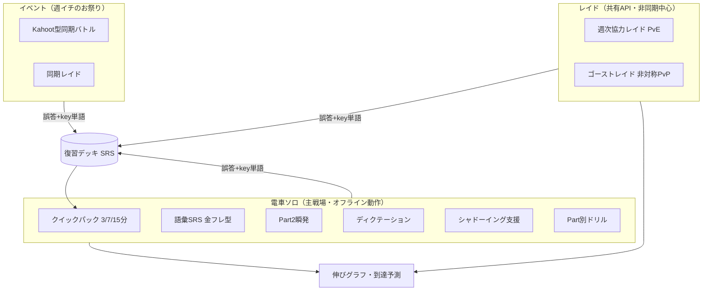

# 02. 機能設計

## 1. モード全体像

**全モード共通の不変ルール（これだけは崩さない）:**

1. **全誤答は復習デッキに落ちる**（key単語もSRSに入る）
2. **得点・ダメージは常にハンディキャップ換算**（素点勝負のモードを作らない）

## 2. 電車ソロセッション（主戦場）

### 2.1 起動体験

- ホーム画面アイコン → 起動即「今日のクエスト」提示 → 1タップでパック開始。ログイン・メニュー遷移なし。
- パックは所要時間で選ぶ: **3分**（駅2つ分: SRS復習のみ）/ **7分**（標準: SRS＋弱点ドリル）/ **15分**（じっくり: ＋Part3/4セット）。
- 中断に強い: 1問単位で自動保存。アプリを閉じても次回同じ場所から。電車を降りる瞬間に離脱しても何も失わない。

### 2.2 片手UI原則

- 解答ボタンは画面下半分（親指リーチ内）。スワイプは左右のみ（つり革姿勢で誤操作しにくい）。
- 音を出せない環境への対応: リスニング問題はイヤホン前提だが、イヤホンなし時は自動でリーディング系パックに差し替える設定を持つ。

### 2.3 パック構成ロジック

「今日のクエスト」は以下の優先度で自動構成（詳細は03）:

1. SRS期限到来カード（語彙＋誤答問題）
2. 現フェーズの学習配分に沿った弱点ドリル（key単語・弱点タグを重み付け）
3. 進行中レイドのダメージ稼ぎ問題（オンライン時）

## 3. リスニング特化機能

初中級者のリスニングは「音が聞き取れない（音声知覚）」が主因。知覚訓練に寄せる。

### 3.1 Part2 瞬発モード
- 連続正解ストリーク表示。中毒性を作る看板モード。
- 疑問詞（What/Where/Who...）の「冒頭だけ再生」聞き取り特訓を含む。
- **再生方法は3つで、Part2単独モードの起動モーダルで選ぶ**（いずれもセッション単位の選択で永続化しない）。

| 再生方法 | 音声 | 選択肢 | 解答受付 |
|---|---|---|---|
| 通常 | 設問部のみ（`questionEndMs` で打ち切り。正答応答のリーク防止） | テキスト3択 | 再生完了後に解禁、**表示から15秒** |
| 冒頭だけ再生（特訓） | 設問の冒頭2.5秒のみ | テキスト3択 | 同上 |
| 音声のみ（本試験形式。T-154） | **設問＋3応答すべて**（約11秒。全長再生） | **記号A/B/Cのみ**（解答後にテキストを開示） | **再生中も解答可**。**再生終了後6秒** |

- 音声のみモードは本試験のPart2（3応答を耳で比較する）に寄せた形式で、既存のテキスト選択肢形式と**トグルで併存**する（[ADR 0008](adr/0008-Part2音声のみモードの併存と音声形式.md)。従来形式は「聞こえた文とテキストの照合」を訓練しており、リスニングと読解の混成になっていた＝[14](14_改善提案_M2ブラッシュアップとM3基盤.md) 3.6-3）。1問あたり約17秒になるため「1問15秒完結」は通常モードのみに適用される。
- 音声のみモードは**応答音声が生成済みの問題（`audioMeta.responseOffsetsMs` を持つ）だけ**を出題する。起動時にプールを絞り、それでも未対応の問題が混入した場合はその問題だけ従来のテキスト選択肢UIへ落とす（進行不能を作らない）。
- 音声のみモードでは選択肢の表示順をシャッフルしない（読み上げ順が key 昇順で音声に焼き込まれているため）。丸暗記対策はコンテンツ側の決定的ローテーションが担う。

### 3.2 ディクテーション
- 短文音声の穴埋め。入力は**ワードバンク（タップ選択）のみ**（M2では見送り=J-12。タイピング入力は表記ゆれ採点の設計コストが電車内操作性に見合わないため実装しない）。
- 弱形（to, for, them等の縮約・脱落）を穴にした問題を優先出題。聞こえない原因の大半はここ。
- 採点は全穴一致で正解・部分点なし（03の8節参照）。

### 3.3 シャドーイング支援（草案「音読！シャドーイング！」対応）

| 段階 | 内容 | 提供 |
|------|------|------|
| L1: 電車対応 | **カラオケ式スクリプトハイライト**（音声同期）＋速度調整＋区間リピート。口パク/脳内シャドーイング用 | コア機能 |
| L2: 自宅用 | 録音→お手本と聞き比べ（セルフチェック） | v2 |
| L3: 自動採点 | 音声認識スコアリング | 見送り（コスト対効果が悪く精度も不安定） |

- **区間リピートは文単位のみ（M2確定=J-23）**。スクリプトを文境界（`.` `?` `!`）で分割し、タップで文を選択→その文をループ再生する。A-B自由指定（任意区間の手動指定）は作らない。

### 3.4 再生コントロール
- 速度: 0.7 / 0.85 / 1.0 / 1.15 / 1.3倍（ピッチ維持）。**1.15倍以上はリスニング段階L4でのみ表示**（03の8節）。
- スクリプト表示切替: 非表示 → 英文 → 英文+和訳。
- 3秒巻き戻しボタン（Part3/4の聞き逃し対応）。

### 3.5 先読みトレーナー（Part3/4）
- 設問先読み→音声再生→解答の型を強制するUI。先読み時間はレベルに応じて調整。
- **先読み秒数・状態遷移（M2確定=J-24。詳細はdocs/13 3.6節）**: フェーズP2=15秒／P3=10秒。①先読みフェーズ（設問・選択肢のみ表示、音声なし、残り秒数表示。満了で自動的に②へ。早期開始タップ可）→②再生フェーズ（スクリプト非表示・一時停止/巻き戻し不可。「型の強制」）→③解答フェーズ（設問1問ずつ）。専用画面は作らずaudio_setのセットモード（S2）の拡張として実装する（J-10）。

## 4. 語彙機能（金フレ型体験）

※金のフレーズのリスト・フレーズは使わない。自前頻出度リスト＋LLM生成フレーズで「体験」を再現する（01のR-1、03参照）。

- **頻出度順レベル別リスト**: 頻出度ランク（S/A/B/C）×目標スコア帯（600/730/860/990）で章立て。
- **1語1フレーズ**: 単語単体でなく短いフレーズで覚える。フレーズにTTS音声付き（聞き流し周回可）。
- **スワイプ操作（新規語彙の仕分け）**: 知ってる/知らないを左右スワイプで高速仕分け→知らない語だけSRSへ。
- **復習は4択リコールテスト→自己評価3段階（2026-07-13改訂）**: SRS復習時は、フレーズ中の対象語を強調表示した上で「この単語の意味は？」と明示し、正解＋他カードの意味から選んだダミー3つの4択で客観的な正誤を確認してから、自己評価3段階（もう一回/OK/余裕。間隔調整用。03の2節）に進む。**改訂理由**: 当初はタップで意味を見た後に自己申告のみで評価しており、客観的な正誤判定が無かった（「本当に問題として機能しているか」という指摘。ドッグフード初期のフィードバックで発覚）。attempts.isCorrectは4択の客観正誤を記録し、自己評価（間隔調整）とは独立させた。
- **key単語との接続**: ドリル誤答のkey単語がこのSRSに合流する。「単語帳で覚える→問題で使う→間違えたら戻ってくる」の循環。

## 5. レイドバトル（統一エンジン）

### 5.1 エンジン定義

ボス = **HP＋防御パターン＋攻撃イベント**のデータ構造。プレイヤーの正解がハンディキャップ換算ダメージになる。ボスの中身の違いだけでモードが分岐する:

| モード | ボスの中身 | 形式 | 優先度 |
|--------|-----------|------|--------|
| A: 週次協力レイド | アプリ生成プロファイル | 非同期PvE。月曜出現→金曜討伐期限 | 最初に実装 |
| B: ゴーストレイド | **人間の解答記録**から変換 | 非同期・非対称PvP | 2番目 |
| A-sync: 同期レイド | アプリ生成 | イベントで15分一斉戦 | 3番目 |
| B-live: 生ボス戦 | 人間がリアルタイム操作（攻撃カード） | イベント | 将来（遊ばれてから投資判断） |

**M4の実装順序の注記（2026-07-23・[21](21_M4タスク分解.md)のJ-62承認）**: 本表の優先度（ゴースト2番目・同期レイド3番目）は参加環境の実測前の想定であり、M4ではイベントバトルを先行する（昼の場が週1回の頻度で既に存在し、M4完了条件の実測がイベントバトルに懸かるため）。

### 5.2 週次協力レイド（A）

- **参加登録**: レイド画面からの opt-in。一度参加すると翌週以降も自動継続（いつでも離脱可）。「参加者」= 月曜のボス出現時点の登録者と定義し、HP算出の母集団にする（03の6.2）。
- 月曜朝にボス出現。HP は参加者全員の期待ダメージ合計から算出（03参照）。途中参加は歓迎し、その週のHPは増やさない。
- 各自が電車セッションで解いた対象問題のダメージが自動加算される（オンライン復帰時に同期）。
- レイド画面: ボスHPバー、今週の参加者の貢献（ハンディ換算ダメージのみ表示、正答率は非表示）、残り日数。
- 討伐成功で全員に報酬（バッジ・称号）。**失敗してもペナルティなし**（罰は継続を殺す）。

### 5.3 ゴーストレイド（B）

- ボス役（希望制・主に上級者）が事前に問題セットを解く→その記録がボスに変換される。
- ボスが正解した問題は「堅い」（ダメージ半減）、ボスが落とした問題は「弱点」（ダメージ2倍）。**上級者でも落とす問題が攻略ポイントになり、レイド隊に戦略が生まれる。**
- ボス役への実利: ボス用セッション自体が高難度ドリル（950狙い層の学習になる）。
- 演出方針: ボスは倒されるのが仕事（目標勝率はレイド隊60–70%）。「討伐された回数」を名誉として表示し、公開処刑にしない。
- 電車からいつでも挑戦可能（ボス記録は静的データなのでオフラインキャッシュも可）。
- **M4実装形態の注記（2026-07-23・[21](21_M4タスク分解.md)のJ-66承認）**: M4では常設のゴースト書庫ではなく「週次ボス枠のghost型」として実装する（承認済みボス役記録がある週のボスがゴーストになる。週内はいつでも挑戦可能なので通勤挑戦の体験は維持される）。常設書庫化は需要が観測されたら再検討。

### 5.4 バランス調整の外出し

ボスHP係数・目標勝率・堅い/弱点の倍率は**設定JSON**に外出しし、コード変更なしで調整可能にする（初回から数値が当たることはあり得ないため）。

## 6. イベント（週イチのお祭り）

**開催時間帯は仕様に含めない。** 参加者が同席できる枠で開催すればよく、昼休みに限定しない（2026-07-28の名称変更で「昼イベント」「昼バトル」から改称。開催頻度・所要時間・完了条件は変更していない）。

### 6.1 Kahoot型同期バトル

- プロジェクター（ホスト画面）: 問題・選択肢・カウントダウン・順位発表。音声は部屋のスピーカーから1系統再生（同期と公平性を担保）。
- 各自の手元スマホ: 選択肢ボタンのみのシンプル画面。解答は個人に紐づきログされる。
- 得点: ハンディキャップ換算＋速度ボーナス（得点の2割以下に制限。速度ゲー化防止）。
- 1バトル10–15問、Part2/5/1中心のテンポ構成。Part7長文はソロ専用。
- 通信は共有API経由（インターネット上）なので、参加者のスマホは自前回線でよく、社内LAN疎通問題は発生しない。

### 6.2 リザルト演出

- 順位（ハンディ換算点）、**ベストグロース賞**（自己平均を最も上回った人）を表彰。最下位でもスポットライトが当たる余地を作る。
- 誤答は各自の復習デッキへ自動登録（画面で確認できる）。

### 6.3 初版の「45分ランチプログラム」の扱い

固定タイムラインは廃止。イベントは「同期バトル or 同期レイドを15–20分」の軽量プリセットに縮小し、残り時間は各自ソロ（任意）とする。全員の45分拘束は継続の敵。

## 7. 継続装置（Duolingo的要素）

| 仕掛け | 内容 | 狙い |
|--------|------|------|
| ストリーク | 連続学習日数。**SRS 5問で成立**する軽い条件。ストリーク保護アイテム（週1回まで欠席を免除） | 継続の主動線。重い条件は折れる |
| 成長ランク | ブロンズ〜マスター。昇格条件は**レート上昇量と学習量**（絶対スコアではない） | 300点でも900点でも同じ土俵 |
| スコア伸びグラフ | レート推移＋予測スコア帯の推移（草案「スコア伸びグラフ」対応） | 成長の可視化 |
| 到達予測 | 現ペース継続時に目標帯へ入る予測時期。ペース不足は不足量を明示 | 楽観表示しない（01のR-2） |
| バッジ | 「Part2 100問」「弱形マスター」「初討伐」等の行動ベース | 弱点科目とレイドへの誘導 |
| レイド連帯 | 「今週みんなで倒す」貢献の可視化 | ソロ習慣への社会性の接ぎ木 |

**やらないこと:** 絶対スコアランキング、罰ゲーム、未学習者への煽り通知、ストリーク切れの脅し演出。

## 8. AI解説

- **事前生成解説（全問必須）**: 作問時にLLM生成→人手レビュー済み。正解根拠＋各誤答選択肢がダメな理由＋和訳。オフラインで読める。
- **オンデマンドAI質問（BYOK）**: 解説画面から「AIに聞く」→ 自分のAPIキー（端末ローカル保存）で「なんでBじゃダメ？」を対話で深掘り。回答は未レビューである旨を表示。刺さったらプロキシ方式に昇格（05参照）。キーは端末内平文保存のため、支出上限を設定したキーの利用を推奨する注記を設定画面に出す。

## 9. 画面一覧

| # | 画面 | 主な要素 | デバイス |
|---|------|---------|---------|
| S1 | ホーム | 今日のクエスト（1タップ開始）、SRS期限数、ストリーク、進行中レイドのHPバー | スマホ |
| S2 | ドリル/パック実行 | 問題、音声プレイヤー、解答UI、解説（＋AIに聞く） | スマホ |
| S3 | 語彙SRS | スワイプ仕分け、フレーズ音声、頻出度ランク表示 | スマホ |
| S4 | シャドーイング | カラオケ式ハイライト、速度、区間リピート | スマホ |
| S5 | レイド | ボスHP、弱点マップ、貢献ログ、挑戦開始 | スマホ |
| S6 | ダッシュボード | 伸びグラフ、予測スコア帯、弱点レーダー、到達予測、学習ヒートマップ | スマホ |
| S7 | イベントバトル（参加） | ルームコード入力、選択肢ボタン | スマホ |
| S8 | イベントバトル（ホスト） | 問題投影、カウントダウン、順位発表 | PC＋プロジェクター |
| S9 | 設定 | 表示名、イヤホンなしモード、APIキー（BYOK）、エクスポート/インポート | スマホ |
| S10 | コンテンツ管理 | LLM生成ジョブ、レビューUI、TTS生成、パックビルド | PC（開発者ローカル） |
