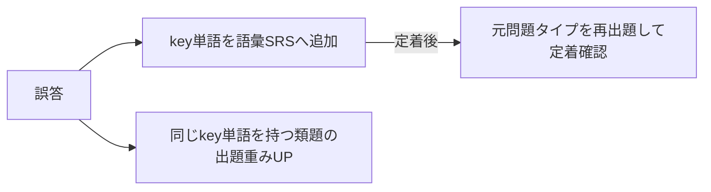

# 03. 学習ロジック設計

このアプリの本体。スコアを実際に上げられるかはここで決まる。全ロジックはクライアント側（端末内）で完結する（共有APIが関与するのはレイドの集計のみ）。

## 1. 380→760 カリキュラム（アプリ内「シーズン」として実装）

### 1.1 前提となる現状分析（380点の典型像）

- L200/R180 前後。語彙が中学〜高1レベルで止まっている。
- Part2: 冒頭の疑問詞が取れない。Part3/4: 音の壁で内容が追えない。
- Part5: 品詞・動詞の形を知識として知らない。Part7: 時間内に半分も読めない。
- **結論: 語彙・音声知覚・品詞文法が三大ボトルネック。長文演習を先にやるのは順序が逆。**

### 1.2 フェーズ設計

| フェーズ | 期間目安 | 到達目標 | 学習配分 | アプリでの表現 |
|---------|---------|---------|---------|---------------|
| P0 診断 | 初日 | レート初期値決定 | アダプティブ30問（L15/R15） | 初回チュートリアル |
| P1 基礎固め | 〜2ヶ月 | 500点台 | 語彙40% / リスニング25% / Part5 25% / 読解10% | シーズン1「土台」 |
| P2 型の習得 | 〜5ヶ月 | 600点台 | 語彙25% / リスニング35% / Part5・6 25% / 読解15% | シーズン2「型」 |
| P3 速度と持久力 | 〜9ヶ月 | 700点台 | 弱点補強50% / リスニング30% / Part5 20% | シーズン3「実戦」 |

- **学習配分は `packages/app/src/engine/curriculumConfig.json`（実装）の値に合わせた**（2026-08-07訂正・T-361・K-95）。旧版は「Part3・4先読み」「Part7シングル/マルチ」等パート単位の理想配分を記載していたが、実装は語彙・リスニング・Part5・読解のバケット単位で配分し、パート内訳（`listeningBreakdown`）は別途L1〜L4段階が決める（8節）。P3の「ミニ模試」は未実装のため06の見送り事項へ移した。
- 期間は「電車往復40分＋就寝前SRS10分」を週5日継続した場合の目安。**個人差が大きく、この期間で760に到達する保証はない**（01のR-2）。遅れはダッシュボードの到達予測に正直に反映する。
- フェーズ移行は期間でなく**達成条件**（例: P1→P2は「頻出度Sランク語彙のSRS定着率85%＋Part2正答率70%」）で判定。時間経過での進級はさせない。
- 730/860帯のユーザーには最初からP3相当＋高難度タグを出す。カリキュラムはレート帯ごとにテンプレートを持つ。
- **達成条件の具体値・定着の定義（M2・T-44確定。実装=T-51。詳細は docs/13 3.1・3.2節）**:
  - P1→P2 = `srsRetention(S)≥0.85 AND accuracy(part2)≥0.70`。**P2→P3 = `srsRetention(A)≥0.75 AND setAccuracy≥0.60(直近20セット) AND accuracy(part5)≥0.70`**。P3は自動卒業なし。`examScore(total≥760)` の登録成立で「シーズンクリア」表示＋バッジ。
  - **「定着」の定義**: 対象ランク語彙のうち導入済み（introducedDate≠null）カードに占める、stage≥2（間隔7日以上に到達）または卒業済み（graduatedAt≠null）のカードの割合。導入済みが20枚未満の間は判定不能（未達扱い）。
  - **初期割当**: P0診断（または自己申告換算）の総合レートR<550→P1、550≤R<650→P2、R≥650→P3。M1からの既存ユーザーはphaseレコード不在のため、M2初回起動時に現在のratingsから同式で1回だけ割当てる。
  - フェーズ移行は1段階ずつ（P1→P3の飛び級はさせない）。移行判定はセッション完了時に評価する。
  - L1–L4（8節）とP1–P3は独立に判定するが、Pのリスニング配分枠の内訳をL段階が決める（8節参照）。

### 1.3 クイックパック生成（02の「今日のクエスト」）

優先度順に詰める:

1. SRS期限超過カード（上限15枚/パック。溢れは次パックへ）
2. 現フェーズの学習配分に沿ったドリル（弱点タグ・key単語を1.5倍重み付け）

レイド対象問題という概念は持たない（M3の設計判断。docs/04 2.2節）。
週次ボスは出題内容を指定せず、各クライアントが自分のプールから通常どおり選ぶ。
通常セッションの解答がそのままダメージへ換算される（6.1節のモード係数）。

## 2. SRS（間隔反復）

SM-2 簡略版。対象は「語彙カード」と「誤答問題」の2種。

- 間隔テーブル: `1日 → 3日 → 7日 → 14日 → 30日 → 60日`（卒業）
- `dueAt` は「実際の現在時刻＋間隔テーブルの最大値（60日）」を上限にクランプする（2026-08-06・T-303・K-31）。端末の時計が進んだ状態で評価するとdueAtが遠未来へ飛び、時計を戻した後もカードが長期間キューに現れなくなるため。
- 自己評価3段階: もう一回（リセット）/ OK（次段階）/ 余裕（1段階スキップ）
- 1日の新規カード上限20枚（変更可）。復習が溜まった日は新規を自動停止。

## 3. key単語システム（草案「間違えたやつのkey単語から別問題」対応)

### 3.1 データ構造

各問題は `keyVocab[]`（この単語が分からないと解けない語）を持つ（04参照）。作問パイプラインでLLMに抽出させ、レビューで確認する。

### 3.2 誤答時のフロー



- 誤答問題そのものの再出題は**同一問題でなく類題を優先**（答えの丸暗記防止）。類題在庫がない場合のみ同一問題を再出題。
- 類題はパイプラインで**頻出key単語1語につきN問**を事前生成してパックに含める（ランタイムLLM生成はしない。コストとオフライン要件のため）。
- 「なぜこの問題が出たか」を明示する: 出題時に「復習: *submit* を使う問題」とラベル表示。学習者に因果が見えると復習の納得感が出る。

## 4. 頻出度リスト（金フレ型体験の土台）

- 頻出度ランク S/A/B/C を自前で定義。初期値は公開コーパス＋LLM推定で構築（**精度は未検証**。市販リストは編集著作物リスクがあるため参照しない。01のR-1）。
- 補正ループ: 全ユーザーの実測データ（出題時の正答率・key単語として誤答に絡んだ回数）で頻出度と難易度を継続補正する。使われるほどリストが賢くなる。
- 補正データの収集経路: **匿名の問題別集計統計 questionStats**（04の4節。個人非紐づけ）。共有API導入（M3）まではユーザーが発起人のみである前提で、端末エクスポートの手動集計を入力にする（06参照）。
- 章立て: ランク×目標スコア帯（600/730/860/990）。P1ユーザーにはSランク×600帯から。

## 5. レーティングとハンディキャップ

### 5.1 レート定義

- 内部レート R: 0–1000。初期値は P0 診断（アダプティブ30問）から。自己申告TOEICスコアがあれば `R = TOEIC × (1000/990)` を事前値として混ぜる（診断中の初期レートに使う）。**自己申告スコアがある場合、この換算値をそのままL/R初期レートとして確定させ、30問診断自体をスキップする導線も用意する**（2026-07-13 発起人指示。診断は「自己申告が無い/大まかな現在地しか分からない人」向けの手段であり、既にTOEICスコアを知っている人にまで30問を強制する理由はないため）。
- L（リスニング）/ R（リーディング）別レート。総合は平均。出題・弱点分析はセクション別を使う。

### 5.2 問題難易度

- 難易度 D（1–5）。初期値は作問時設定、以降は実測正答率で補正（IRT 1PL の簡略運用。補正はコンテンツビルド時に匿名問題統計 questionStats の集計から実施。04の4節）。
- レート空間への写像: `d = 150 + 170 × D`（D=1→320, D=5→1000）。係数は運用調整前提の初期値。

### 5.3 期待正答率と得点（全モード共通）

```
p = 1 / (1 + 10^((d − R) / 300))          … Elo式期待正答率
基礎点 = round(100 × (1.4 − p))            … クランプ [40, 130]
誤答 = 0点（マイナスなし）
```

例: レート400が d=650 に正解 → p≈0.13 → 127点。レート900が同問正解 → p≈0.87 → 53点。

**速度ボーナス（同期バトルの正解時のみ。2026-08-07訂正・T-357・K-91）**: 実装（`api/src/battleRoomDo.ts`）は残り時間比率ではなく解答順位で決まる。

```
速度ボーナス = round(基礎点 × 0.2 × (1 − (順位 − 1) / 分母))   … 0未満はクランプ
分母 = max(現在接続中の参加者数, 実際にその設問へ解答した人数)
```

1位（順位=1）で基礎点の最大20%、以降順位が下がるほど比率が減り、最終順位でおおむね0になる。分母を「接続中人数」と「実際の解答者数」の大きい方にするのは、解答直後に瞬断した参加者がいても比率が1を超えて負値化しない（＝遅い回答者の得点が基礎点を下回らない）ようにするため（T-336・K-71）。旧記述の「round(20 × 残り時間比率)・最大20」は当時の設計案であり、実装されていない。docs/02 6.1節「得点の2割以下に制限」の記述と整合する。

### 5.4 レート更新

```
R' = R + K × (result − p)    K = 16（最初の50問は K = 32）
```

- 全解答で更新。ただしSRS復習（既知カードの反復）は対象外（レートが不当に上がる）。
- **「最初の50問」の実装上の解釈（docs未記載だった判断。M2・T-44で反映）**: L/Rの**セクション別**カウントで判定する（`ratings.answerCount`。L・Rそれぞれが50問に達するまで個別にK=32を適用し、達した後はK=16に切り替わる。L/R合算のカウントではない）。
- P0診断を経た場合、診断で消費した解答数（L/R各15問）を `ratings.answerCount` の初期値として引き継ぐ（2026-08-06・T-306・K-34）。従来は常に0で初期化していたため、診断の15問を終えた直後からさらに50問ぶんの早期Kが乗り、K=32の区間が仕様より長引いていた。自己申告スコアで診断をスキップした場合は0から開始する。

### 5.5 予測スコアと伸びグラフ

- `予測TOEIC = 総合レート × 0.99` 中心に ±50 の帯で表示。社内問題での推定であり本試験との相関は**未検証**。「参考値」明記、断定表示しない。
- レートは日次スナップショットを端末に保存し、伸びグラフ（草案要望）と到達予測の入力にする。
- 実試験・IPテストのスコアを任意登録でき、予測との乖離を将来の校正データにする。
- **到達予測の算出式（M2・T-44確定。実装=T-53。詳細は docs/13 3.3節）**: `ratingHistory`（section='total'）の直近28日を最小二乗の線形回帰し、傾き s（レート/日）を得る。目標レート=768（760×1000/990）。
  - データが14日分未満 → 「計測中」表示。
  - s>0 → 到達日数=(768−現在レート)/s を月粒度に丸め「YYYY年M月頃」と表示（±の幅は出さない。「参考値」注記必須）。ただし到達日数が**1095日（約3年）を超える場合は「到達しない」側として扱う**（2026-08-06・T-310・K-39。傾きがわずかに正のときに「2127年頃」のような非現実的な表示になるため）。非有限値も同様に扱う。
  - s≤0 → 「このペースでは到達しない」＋不足量: 現ペースの学習日あたり平均上昇から「週の学習日数をあとN日増やす」（N=1–7に切り上げ）換算で表示。ただし**既に週7日学習している場合はこの助言が成立しない**ため、日数以外の助言へ分岐する（2026-08-06・T-310・K-40）。

### 5.6 既知の穴: サンドバッグ（意図的レート下げ）

基礎点はレートが低いほど大きいため、易問でわざと誤答してレートを下げれば、以後の正解ダメージを盛ることが可能。仲間内運用では実害が小さいと判断し、**当面は対策せず既知の穴として明記する**（01のR-3）。ゴーストレイド等の対人文脈で表面化したら以下を検討:

- 貢献表示を実ダメージでなく「自分の期待ダメージ比（普段どおりやったか）」に変更
- レートの短期間の急落を検知し、急落中はダメージ計算のレートを据え置く

**2026-08-06再評価（T-314・K-42・J-123）**: M4（ゴーストレイド＋イベントバトル。対人文脈）到達により「表面化したら検討」の条件が満たされたが、再評価の結果、対策は実装しない。仲間内運用（信頼できる少人数）が前提であり、意図的なレート下げによる実害（他者への不公平感等）が限定的なままと判断したため。ADRには起こさず、この節への追記のみで決定を残す。次の見直し契機は運用規模の拡大（不特定多数への公開等）とする。

## 6. レイドのダメージ・HP計算

### 6.1 ダメージ（プレイヤー→ボス）

```
ダメージ = 基礎点（5.3と同一式）× モード係数
```

ハンディキャップ換算をそのまま使うので、300点の1正解も900点の1正解も「貢献」として同じ土俵に乗る。

**モード係数（M3・J-47で確定。暫定値・ドッグフード実測で調整する）**:

| mode | 係数 | 備考 |
|------|------|------|
| raid | 1.0 | S5専用セッション（レイド参加ボタンからの起動）のみに付与（J-47-2）。通常のクエスト・単独モードには付与しない |
| solo | 0.5 | 通常のソロ学習（電車セッション・クイックパック等）。レイド参加中でも常時この係数で貢献する |
| srs | 0 | 語彙SRS・誤答復習デッキはダメージ換算対象外 |
| battle | — | ゴーストレイドの防御換算（6.3の別式）用。M4以降 |

実装は `packages/app/src/engine/damage.ts`（T-89）・`packages/app/src/engine/damageConfig.json` に外出し。未定義modeは0を返す。

### 6.2 ボスHP（週次協力レイド A）

```
HP = Σ_参加者( 平均ダメージ/問 × 想定消化問題数/日 × 5日 ) × 討伐率係数
```

- 「参加者」= **登録メンバー全員**（02の5.2）。サーバーにopt-in用のjoin APIを作らない方針（17の3.4節）のため、レイド画面の「参加」操作（raidState書込）はUI表示・端末側のraidSyncEnabled切替のみに使い、HP算出の母数からは絞り込まない（2026-08-07訂正・T-360・K-94。opt-in登録者限定という記述はdocs/17の実装と食い違っていた）。
- 式中の「5日」は実装の `RAID_DAYS`（=5）である。一方でダメージの帰属期間は月曜9:00 JST〜土曜0:00 JSTで、実長は4日15時間（4.625日）しかない。想定消化問題数を5日分積んだHPを4.625日で削ることになるため、ボスは約8%硬くなる（K-93）。窓もHP係数も本番稼働中の週をまたぐバランス影響が大きいため変更対象外とする（J-121。17の3.4節）。
- 想定消化問題数は各人の直近2週間の実績から推定（新規参加者はデフォルト値）。
- 討伐率係数は設定JSONで外出し（初期値 0.85 = 「全員が普段どおりやれば木曜に倒せる」想定）。目標討伐成功率は70–80%。
- 参加者が途中で増えたらHPは増やさない（途中参加を歓迎する側に倒す）。

### 6.3 ゴーストボスの防御（B）

ボス役の解答記録から問題ごとに変換:

```
ボスが正解した問題: 被ダメージ × 0.5（堅い）
ボスが誤答した問題: 被ダメージ × 2.0（弱点。UI上で可視化）
ボスHP = 週次レイドと同式 × ゴースト係数（設定値）
```

- 倍率は設定JSONで調整可能。目標勝率はレイド隊60–70%。
- ボス役の解答は高難度セット（D4–5中心）から出題し、「弱点」が必ず一定数生まれるようにする（全問正解の完璧ボスは攻略が単調になるため、セット難易度で自然に穴を作る）。

## 7. 弱点分析

### 7.1 スキルタグ体系（初期セット）

| 分類 | タグ例 |
|------|--------|
| 語彙 | 頻出動詞 / ビジネス名詞 / 前置詞コロケーション / 言い換え語彙 |
| 文法 | 品詞 / 動詞の形 / 代名詞・関係詞 / 接続詞vs前置詞 / 比較 |
| 音声知覚 | 疑問詞聞き取り / 弱形・連結 / 数字・時刻 / 米英アクセント（T-82・J-31で改名。豪加TTSは未調達のため実効タグは米英のみ。調達できたら再改名） |
| 解法 | 先読み / 意図推定 / 図表参照 / パラフレーズ照合 / 速読 |

1問に複数タグ可。タグ別正答率（直近100問の移動窓）を弱い順の横棒で示し（07の8節。レーダーチャートは使わない）、**重み付き出題数が5以上かつ正答率60%未満**を「弱点」として出題重みを上げる。最小標本数を設けるのは、数問の誤答だけで全タグが弱点化するのを防ぐためである。key単語システム（3節）はこのタグ機構の語彙特化版として重ねて動く。

### 7.2 誤答の質の区別

- 解答時間 <2秒 の解答は、**正誤を問わず**弱点統計の重みを 0.5 に下げる（2026-08-06・T-309・K-38。時間切れは除く）。誤答の当て勘だけを軽く数えてまぐれ正解を満額計上すると、当て勘の多いタグほど正答率が実力より高く出て弱点として立たなくなるため、正誤に対称に適用する。`attempts.isGuess` フラグ自体は従来どおり「誤答かつ2秒未満」の記録として維持する。
- 時間切れは「速度不足」として別カウント（知識不足と混ぜると分析が濁る）。

## 8. リスニング学習の段階設計

音声知覚→意味理解→解答処理の順に負荷を上げる。

| 段階 | 訓練 | 卒業条件（目安） |
|------|------|-----------------|
| L1 音の知覚 | ディクテーション（弱形・連結）、シャドーイング支援（カラオケ式）、0.85倍速可 | 弱形タグ正答率 75% |
| L2 一文理解 | Part2瞬発（等倍） | Part2 正答率 70% |
| L3 会話追跡 | Part3/4 先読みトレーナー（設問1問ずつ） | セット正答率 60% |
| L4 実戦 | Part3/4 通し＋1.15倍速負荷 | — |

倍速負荷（1.15x）は L4 のみ解禁。基礎段階で倍速を使うと知覚が雑になるため。

**L段階の判定条件・実装確定（M2・T-44。詳細は docs/13 3.2・3.4・3.5節）**:
- L1→L2 = 弱形・連結タグの正答率≥0.75（直近100問の移動窓）。L2→L3 = Part2正答率≥0.70。L3→L4 = セット正答率（audio_set 1セット2/3問以上正解）≥0.60（直近20セット）。L4は終端（倍速1.15x以上の解禁のみで、それ以上の卒業条件はない）。
- リスニングは段階スキップさせない（常にL1から開始。03の思想どおり）。
- **ディクテーションの採点**: ワードバンク方式のみ（タイピング入力はM2では見送り）。全穴一致で正解、部分点なし。大文字小文字は無視。**レート更新の対象外**（5.3節の得点式は選択式前提のため）。tagStats（弱形タグ）には反映する（L1卒業判定の入力になるため）。
- **シャドーイングの記録規約**: 正誤判定なし。1素材の再生完了（最後まで到達 or 3周）で `attempts` に `questionId: 'shadow:<id>'`・`isCorrect: true` 固定で1件追記する（`vocab:` プレフィックスと同様に問題別統計・レート・tagStats・SRSの対象外とし、ストリーク成立にはカウントする）。
