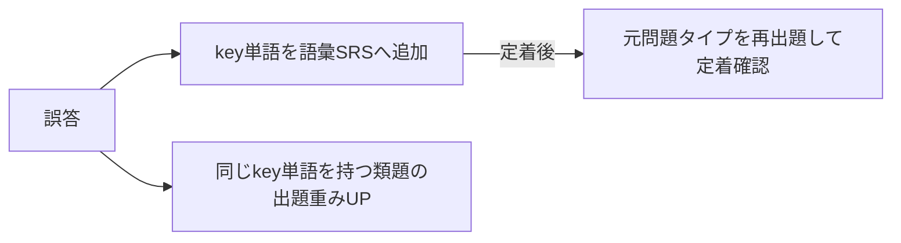

# 03. 学習ロジック設計

このアプリの本体。スコアを実際に上げられるかはここで決まる。全ロジックはクライアント側（端末内）で完結する（共有APIが関与するのはレイドの集計のみ）。

## 1. 380→760 カリキュラム（アプリ内「シーズン」として実装）

### 1.1 前提となる現状分析（380点の典型像）

- L200/R180 前後。語彙が中学〜高1レベルで止まっている。
- Part2: 冒頭の疑問詞が取れない。Part3/4: 音の壁で内容が追えない。
- Part5: 品詞・動詞の形を知識として知らない。Part7: 時間内に半分も読めない。
- **結論: 語彙・音声知覚・品詞文法が三大ボトルネック。長文演習を先にやるのは順序が逆。**

### 1.2 フェーズ設計

| フェーズ | 期間目安 | 到達目標 | 学習配分 | アプリでの表現 |
|---------|---------|---------|---------|---------------|
| P0 診断 | 初日 | レート初期値決定 | アダプティブ30問（L15/R15） | 初回チュートリアル |
| P1 基礎固め | 〜2ヶ月 | 500点台 | 語彙50% / Part2 25% / Part5品詞 25% | シーズン1「土台」 |
| P2 型の習得 | 〜5ヶ月 | 600点台 | 語彙25% / Part3・4先読み 35% / Part5・6 25% / Part7シングル15% | シーズン2「型」 |
| P3 速度と持久力 | 〜9ヶ月 | 700点台 | ミニ模試30% / Part7マルチ30% / 弱点補強40% | シーズン3「実戦」 |

- 期間は「電車往復40分＋就寝前SRS10分」を週5日継続した場合の目安。**個人差が大きく、この期間で760に到達する保証はない**（01のR-2）。遅れはダッシュボードの到達予測に正直に反映する。
- フェーズ移行は期間でなく**達成条件**（例: P1→P2は「頻出度Sランク語彙のSRS定着率85%＋Part2正答率70%」）で判定。時間経過での進級はさせない。
- 730/860帯のユーザーには最初からP3相当＋高難度タグを出す。カリキュラムはレート帯ごとにテンプレートを持つ。

### 1.3 クイックパック生成（02の「今日のクエスト」）

優先度順に詰める:

1. SRS期限超過カード（上限15枚/パック。溢れは次パックへ）
2. 現フェーズの学習配分に沿ったドリル（弱点タグ・key単語を1.5倍重み付け）
3. 進行中レイドの対象問題（オンライン時。ダメージがそのまま学習になる）

## 2. SRS（間隔反復）

SM-2 簡略版。対象は「語彙カード」と「誤答問題」の2種。

- 間隔テーブル: `1日 → 3日 → 7日 → 14日 → 30日 → 60日`（卒業）
- 自己評価3段階: もう一回（リセット）/ OK（次段階）/ 余裕（1段階スキップ）
- 1日の新規カード上限20枚（変更可）。復習が溜まった日は新規を自動停止。

## 3. key単語システム（草案「間違えたやつのkey単語から別問題」対応)

### 3.1 データ構造

各問題は `keyVocab[]`（この単語が分からないと解けない語）を持つ（04参照）。作問パイプラインでLLMに抽出させ、レビューで確認する。

### 3.2 誤答時のフロー



- 誤答問題そのものの再出題は**同一問題でなく類題を優先**（答えの丸暗記防止）。類題在庫がない場合のみ同一問題を再出題。
- 類題はパイプラインで**頻出key単語1語につきN問**を事前生成してパックに含める（ランタイムLLM生成はしない。コストとオフライン要件のため）。
- 「なぜこの問題が出たか」を明示する: 出題時に「復習: *submit* を使う問題」とラベル表示。学習者に因果が見えると復習の納得感が出る。

## 4. 頻出度リスト（金フレ型体験の土台）

- 頻出度ランク S/A/B/C を自前で定義。初期値は公開コーパス＋LLM推定で構築（**精度は未検証**。市販リストは編集著作物リスクがあるため参照しない。01のR-1）。
- 補正ループ: 全ユーザーの実測データ（出題時の正答率・key単語として誤答に絡んだ回数）で頻出度と難易度を継続補正する。使われるほどリストが賢くなる。
- 補正データの収集経路: **匿名の問題別集計統計 questionStats**（04の4節。個人非紐づけ）。共有API導入（M3）まではユーザーが発起人のみである前提で、端末エクスポートの手動集計を入力にする（06参照）。
- 章立て: ランク×目標スコア帯（600/730/860/990）。P1ユーザーにはSランク×600帯から。

## 5. レーティングとハンディキャップ

### 5.1 レート定義

- 内部レート R: 0–1000。初期値は P0 診断（アダプティブ30問）から。自己申告TOEICスコアがあれば `R = TOEIC × (1000/990)` を事前値として混ぜる（診断中の初期レートに使う）。**自己申告スコアがある場合、この換算値をそのままL/R初期レートとして確定させ、30問診断自体をスキップする導線も用意する**（2026-07-13 発起人指示。診断は「自己申告が無い/大まかな現在地しか分からない人」向けの手段であり、既にTOEICスコアを知っている人にまで30問を強制する理由はないため）。
- L（リスニング）/ R（リーディング）別レート。総合は平均。出題・弱点分析はセクション別を使う。

### 5.2 問題難易度

- 難易度 D（1–5）。初期値は作問時設定、以降は実測正答率で補正（IRT 1PL の簡略運用。補正はコンテンツビルド時に匿名問題統計 questionStats の集計から実施。04の4節）。
- レート空間への写像: `d = 150 + 170 × D`（D=1→320, D=5→1000）。係数は運用調整前提の初期値。

### 5.3 期待正答率と得点（全モード共通）

```
p = 1 / (1 + 10^((d − R) / 300))          … Elo式期待正答率
基礎点 = round(100 × (1.4 − p))            … クランプ [40, 130]
速度ボーナス = round(20 × 残り時間比率)      … 同期バトルの正解時のみ、最大20
誤答 = 0点（マイナスなし）
```

例: レート400が d=650 に正解 → p≈0.13 → 127点。レート900が同問正解 → p≈0.87 → 53点。

### 5.4 レート更新

```
R' = R + K × (result − p)    K = 16（最初の50問は K = 32）
```

- 全解答で更新。ただしSRS復習（既知カードの反復）は対象外（レートが不当に上がる）。

### 5.5 予測スコアと伸びグラフ

- `予測TOEIC = 総合レート × 0.99` 中心に ±50 の帯で表示。社内問題での推定であり本試験との相関は**未検証**。「参考値」明記、断定表示しない。
- レートは日次スナップショットを端末に保存し、伸びグラフ（草案要望）と到達予測の入力にする。
- 実試験・IPテストのスコアを任意登録でき、予測との乖離を将来の校正データにする。

### 5.6 既知の穴: サンドバッグ（意図的レート下げ）

基礎点はレートが低いほど大きいため、易問でわざと誤答してレートを下げれば、以後の正解ダメージを盛ることが可能。仲間内運用では実害が小さいと判断し、**当面は対策せず既知の穴として明記する**（01のR-3）。ゴーストレイド等の対人文脈で表面化したら以下を検討:

- 貢献表示を実ダメージでなく「自分の期待ダメージ比（普段どおりやったか）」に変更
- レートの短期間の急落を検知し、急落中はダメージ計算のレートを据え置く

## 6. レイドのダメージ・HP計算

### 6.1 ダメージ（プレイヤー→ボス）

```
ダメージ = 基礎点（5.3と同一式）× モード係数
```

ハンディキャップ換算をそのまま使うので、300点の1正解も900点の1正解も「貢献」として同じ土俵に乗る。

### 6.2 ボスHP（週次協力レイド A）

```
HP = Σ_参加者( 平均ダメージ/問 × 想定消化問題数/日 × 5日 ) × 討伐率係数
```

- 「参加者」= 月曜のボス出現時点でレイド参加登録（opt-in）済みのメンバー（02の5.2）。
- 想定消化問題数は各人の直近2週間の実績から推定（新規参加者はデフォルト値）。
- 討伐率係数は設定JSONで外出し（初期値 0.85 = 「全員が普段どおりやれば木曜に倒せる」想定）。目標討伐成功率は70–80%。
- 参加者が途中で増えたらHPは増やさない（途中参加を歓迎する側に倒す）。

### 6.3 ゴーストボスの防御（B）

ボス役の解答記録から問題ごとに変換:

```
ボスが正解した問題: 被ダメージ × 0.5（堅い）
ボスが誤答した問題: 被ダメージ × 2.0（弱点。UI上で可視化）
ボスHP = 週次レイドと同式 × ゴースト係数（設定値）
```

- 倍率は設定JSONで調整可能。目標勝率はレイド隊60–70%。
- ボス役の解答は高難度セット（D4–5中心）から出題し、「弱点」が必ず一定数生まれるようにする（全問正解の完璧ボスは攻略が単調になるため、セット難易度で自然に穴を作る）。

## 7. 弱点分析

### 7.1 スキルタグ体系（初期セット）

| 分類 | タグ例 |
|------|--------|
| 語彙 | 頻出動詞 / ビジネス名詞 / 前置詞コロケーション / 言い換え語彙 |
| 文法 | 品詞 / 動詞の形 / 代名詞・関係詞 / 接続詞vs前置詞 / 比較 |
| 音声知覚 | 疑問詞聞き取り / 弱形・連結 / 数字・時刻 / 米英豪加アクセント |
| 解法 | 先読み / 意図推定 / 図表参照 / パラフレーズ照合 / 速読 |

1問に複数タグ可。タグ別正答率（直近100問の移動窓）でレーダーを描き、60%未満を「弱点」として出題重みを上げる。key単語システム（3節）はこのタグ機構の語彙特化版として重ねて動く。

### 7.2 誤答の質の区別

- 解答時間 <2秒 の誤答は「当て勘」フラグを付け、弱点統計の重みを下げる。
- 時間切れは「速度不足」として別カウント（知識不足と混ぜると分析が濁る）。

## 8. リスニング学習の段階設計

音声知覚→意味理解→解答処理の順に負荷を上げる。

| 段階 | 訓練 | 卒業条件（目安） |
|------|------|-----------------|
| L1 音の知覚 | ディクテーション（弱形・連結）、シャドーイング支援（カラオケ式）、0.85倍速可 | 弱形タグ正答率 75% |
| L2 一文理解 | Part2瞬発（等倍） | Part2 正答率 70% |
| L3 会話追跡 | Part3/4 先読みトレーナー（設問1問ずつ） | セット正答率 60% |
| L4 実戦 | Part3/4 通し＋1.15倍速負荷 | — |

倍速負荷（1.15x）は L4 のみ解禁。基礎段階で倍速を使うと知覚が雑になるため。
