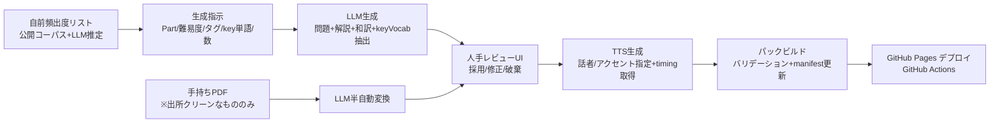

# 04. データ設計

## 1. データの置き場所（3層）

| 層 | 置き場所 | 内容 | 特性 |
|----|---------|------|------|
| コンテンツ | GitHub Pages（静的） | 問題パックJSON＋TTS音声mp3＋ボスプロファイル | 全世界公開に耐えるものだけ。ビルド時に生成 |
| 個人データ | 端末内 IndexedDB | 解答ログ・SRS・レート履歴・設定 | local-first。エクスポート/インポート可 |
| 共有データ | 共有API（Cloudflare Workers + KV/DO想定） | レイド進行・ゴースト記録・表示名・匿名問題統計 | 極小に絞る。消えてもソロは無傷 |

**原則: 個人に紐づく情報（本名・社名・個人単位の正誤・成績詳細）はコンテンツ層・共有層に置かない。** 個人に紐づかない匿名集計（問題別の正答率統計）はこの原則の対象外とし、難易度・頻出度補正のために共有層で扱う（4節）。

## 2. 問題パック JSON スキーマ（コンテンツ層）

正本は JSON。PDF は取込ソースに過ぎず直接扱わない。`license` / `origin` 必須（出所不明パックは取込拒否）。

```jsonc
{
  "schemaVersion": 2,
  "pack": {
    "id": "pack-p2-listening-001",
    "title": "Part2瞬発 基礎01",
    "license": "internal-original",     // internal-original | cc-by | public-domain
    "origin": "LLM生成+レビュー済 2026-07",
    "targetLevel": [300, 500],
    "sizeBytes": 4200000                 // オフラインキャッシュの容量表示用
  },
  "questions": [
    {
      "id": "q-0001",
      "part": 2,                         // 1–7 | 0(語彙カード)
      "format": "audio_qa",              // audio_qa | audio_photo | audio_set | text_blank | text_passage | vocab_card | dictation | shadowing
      "difficulty": 2,                   // 1–5（実測補正はビルド時に反映）
      "tags": ["疑問詞聞き取り", "弱形・連結"],
      "keyVocab": [                      // ★key単語システム（03参照）
        { "word": "submit", "sense": "提出する", "freqRank": "S" }
      ],
      "audio": "audio/q-0001.mp3",
      "audioMeta": { "accent": "US", "tts": true, "voice": "en-US-Andrew", "durationMs": 6200 },
      "timing": null,                    // shadowing用: 単語ごとの開始ms配列（カラオケハイライト）
      "image": null,
      "script": "Where should I submit the expense report?",
      "translation": "経費精算書はどこに提出すればよいですか。",
      "question": null,
      "choices": [
        { "key": "A", "text": "To the accounting portal." },
        { "key": "B", "text": "By Friday afternoon." },
        { "key": "C", "text": "Yes, I reported it." }
      ],
      "answer": "A",
      "explanation": "Where への応答は場所。B は When、C は音のひっかけ（report）。",
      "blanks": null                     // dictation用: [{ "index": 3, "answer": "should" }]
    }
  ]
}
```

- `format: audio_set`（Part3/4）は `subQuestions[]` で1音声に設問3問。
- `vocab_card` は `front / phrase / phraseAudio / back / freqRank / levelBand` を持つ（金フレ型体験の1語1フレーズ）。
- `shadowing` は `timing`（単語別タイムスタンプ）必須。TTS生成時に音声合成のメタデータから取得する。
- 取込/ビルド時バリデーション: スキーマ検証、音声・timing存在チェック、answer整合、keyVocab存在チェック（検査対象フィールドはformat毎に定義: audio系=script、text系=question＋choices、vocab_card=phrase）、license/origin必須。エラーはパック単位で全件レポート、部分取込なし。
- **M2検証強化（T-41=C-1改訂。2026-07-14）**: `audio_photo` は `image` 必須（非空文字列）。`vocab_card` の `levelBand` は 600/730/860/990 のenumチェック。`dictation` の `blanks[].index` は script の語数（空白区切り）未満、かつ `blanks[].answer` が script の該当位置の語と一致（大文字小文字無視・前後の句読点 `.,?!;:'"` を除去して比較）。`shadowing` の `timing` は単調増加（非減少）・全要素0以上・要素数が script の語数と一致。`audio_set` の `subQuestions` は1〜5件、各 `id` はパック内で一意。

### 2.1 マニフェスト

`manifest.json` にパック一覧（id・タイトル・対象レート帯・サイズ・バージョンハッシュ）を持ち、アプリはこれを見て更新検知とキャッシュ管理を行う。

### 2.2 ボスプロファイル（コンテンツ層 or 共有層）

```jsonc
{
  "bossId": "raid-2026-w28",
  "type": "synthetic",                  // synthetic(A) | ghost(B)
  "title": "今週のボス: The Deadline Dragon",
  "questionPackIds": ["pack-p2-001", "pack-p5-003"],
  "hp": 42000,                          // 共有APIが参加者実績から算出（A）
  "defense": [                          // ghost時のみ: ボス役の解答記録から変換
    { "questionId": "q-0102", "result": "correct", "multiplier": 0.5 },
    { "questionId": "q-0103", "result": "wrong",  "multiplier": 2.0 }
  ],
  "balance": { "clearRateTarget": 0.75, "hpCoef": 0.85 }   // 外出し調整値（03参照）
}
```

ゴーストの `defense` には**ボス役の個人成績そのもの**が含まれるため、ボス役の明示同意（ボス役登録時のUI確認）を必須とする。

## 3. 個人データ（IndexedDB スキーマ）

| ストア | 主なフィールド | 備考 |
|--------|---------------|------|
| profile | displayName, initialToeic(null可), createdAt, deviceToken | deviceTokenは共有API用の匿名ID |
| attempts | id, questionId, mode(solo/raid/battle/srs), isCorrect, responseMs, isTimeout, answeredAt | **全解答の生ログ。分析の基盤なので消さない** |
| srsCards | id, refType(vocab/question), refId, stage(0–5), dueAt, lapses | |
| ratings | section(L/R/total), rating, updatedAt | 現在値 |
| ratingHistory | date, section, rating | 日次スナップショット。伸びグラフの入力 |
| tagStats | tag, window100の正答数/出題数 | レーダー描画用サマリ（attemptsから再構築可能） |
| phase | season(P1/P2/P3), criteriaJson, achievedAt | カリキュラム進行 |
| streak | currentDays, bestDays, lastActiveDate, protectionUsedAt | |
| badges | badgeId, earnedAt | |
| pendingSync | レイドダメージ等の未送信キュー | オフライン時に蓄積→復帰時に送信 |
| settings | イヤホンなしモード, 再生速度既定, BYOKキー(端末内平文保存。支出上限付きキーを推奨する注記を表示), キャッシュ済みパック一覧 | 実装上のキー名: `byokApiKey`（BYOK APIキー本体）・`byokModel`（使用モデルID）。**`byokApiKey` はエクスポートJSONから除外**（本節末尾参照） |
| examScores | id, date, listening, reading, total, source(IP/公開/その他), note? | **M2で新設（T-42=C-2改訂）**。実試験・IPテストスコアの任意登録（03の5.5節・06の4節）。予測スコアとの乖離の校正データ・シーズンクリア判定（J-16）に使う |

- **実装差分（M1完了時点。T-42=C-2改訂で反映）**: `attempts` は `isGuess`（当て勘フラグ）も持つ（03の7.2節）。`srsCards` は `introducedDate`（新規上限20枚/日の集計）・`graduatedAt`（卒業時刻）・`sourceQuestionId`（誤答由来カードの発生元問題ID）を非インデックスフィールドとして持つ。`ratings` は `answerCount`（K=32判定用のセクション別解答数。5.4節参照）を持つ。`settings` は `activeSession`（セッション中断復帰用のスナップショット）キーも使う。`phase` は M2で `listeningStage`（03の8節 L1–L4）を非インデックスフィールドとして持つ。
- Dexieスキーマは `version(1)`（M1時点の全11ストア）→`version(2)`（M2。`examScores` 追加。既存ストアの定義自体は変更なし）。
- 容量目安: attempts 年3万行×200B ≈ 6MB。音声キャッシュ（Cache Storage側）が支配的で100–200MB。
- **エクスポート/インポート**: 全ストアをJSON1ファイルに書き出し/読み込み。機種変とiOSストレージ退避（01のR-5）への保険。共有API接続時は週次自動バックアップも可（v2）。**`byokApiKey` はエクスポートJSONに含めない**（端末外に出さない不変条件。T-42=C-2改訂で `EXPORT_EXCLUDED_KEYS` として実装。インポート側も外部編集で混入した場合に備え多層防御で除外する）。バックアップの `dbVersion` が導入前のストア（例: `version(1)`時代のバックアップに `examScores` が無い）は欠落を正常として許容し、`dbVersion` がそのストア導入後にもかかわらず欠落している場合のみ不正として拒否する。

## 4. 共有データ（共有API側・極小）

| データ | フィールド | 備考 |
|--------|-----------|------|
| members | deviceToken, displayName, ratingBand(粗い帯のみ) | 本名・詳細成績は持たない |
| raids | bossId, profileJson, status, startAt, endAt | |
| damageLogs | bossId, deviceToken, damage, questionCount, syncedAt | **ダメージ換算値のみ。正誤詳細は送らない** |
| ghosts | bossId, ボス役deviceToken, defenseJson, 同意フラグ | **同意撤回・削除APIを必須とする**（撤回時は即時削除。M4） |
| battleRooms | roomId, code, 進行状態 | 昼イベント用。揮発でよい（Durable Object内） |
| questionStats | questionId, 正答数, 誤答数, timeout数 | **匿名集計。deviceTokenと紐づけて保存しない**。難易度・頻出度補正の入力（03参照）。ビルド時に取得して反映 |

設計方針: 共有APIは「集計板」であって学習データの正本ではない。全損しても各端末のIndexedDBから個人学習は継続でき、レイドだけが止まる。個人紐づきで送るのはダメージ換算値と表示名のみという原則は維持し、questionStats は認証（招待コード）は通すが**個人と結合できない形**でのみ受け付ける。

## 5. コンテンツ生成パイプライン（ビルド時・ローカル実行）

ランタイムのLLM/TTS課金をゼロにするため、生成は全て開発者ローカル＋CIビルド時に行う。



- **人手レビュー必須**（正答の妥当性・ひっかけの質・不自然な英文の除去）。破棄理由はプロンプト改善にフィードバック。
- 類題の事前生成: 頻出度S/Aランクのkey単語1語につき類題N問（初期N=3）を生成してパックに含める（03のkey単語システムの在庫）。
- TTSは**米/英/豪の3アクセント**の話者をローテーションし `audioMeta.accent` に記録。Part2は設問と応答で別話者。加（CA）はスキーマ上の有効値として残すが、M1の生成では使わない（TTSプロバイダの選択肢を確保するための縮退。CA音声を持つプロバイダは限られるため。採用プロバイダがCA対応なら復活してよい）。
- 「問題おかしい」報告（アプリ内ボタン）は共有API経由で集約し、次回ビルドで出題停止→再レビュー。
- 実測補正: ビルド時に共有APIから questionStats を取得し、難易度（IRT簡略）と頻出度ランクを補正して次版パックに反映（03参照）。共有API導入前（M3以前）は発起人端末のエクスポートを手動投入で代替。
- APIキー（LLM/TTS）はローカル環境変数と GitHub Actions Secrets のみに置く。リポジトリに含めない。

## 6. 音声・オフラインキャッシュ

- 音声は mp3（モノラル64–96kbps、Part2短文で1問30–60KB目安）。
- Service Worker のキャッシュ戦略: アプリシェルは precache、パックは「現フェーズ＋進行中レイドの対象パック」を自動ピン留め、それ以外はオンデマンド＋LRU削除。
- 設定画面にキャッシュ使用量と手動削除を表示（スマホ容量への配慮）。
