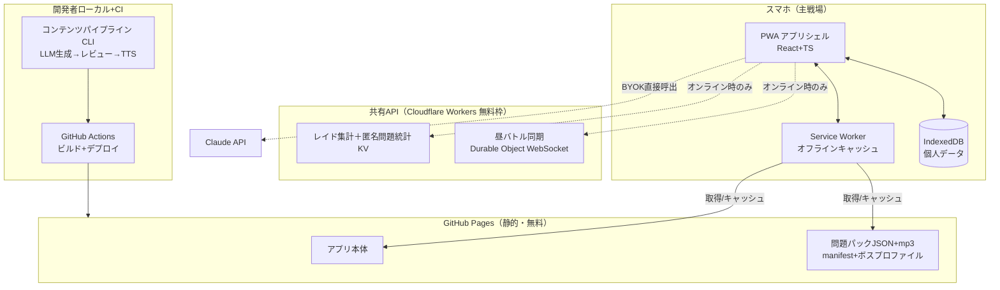

# 05. アーキテクチャ設計

## 1. 全体像: 静的PWA＋極小共有API

**依存の方向が重要**: ソロ学習は Pages＋端末内だけで完結する。共有APIは「あれば楽しい」レイヤで、落ちてもソロは無傷（01のR-7）。

## 2. 技術スタック

| レイヤ | 技術 | 選定理由 |
|--------|------|---------|
| フロント | React + TypeScript + Vite | スマホUI・PWA実績。**Capacitorラップでのネイティブ化路線を確保**（7節） |
| PWA | vite-plugin-pwa（Workbox） | precache＋ランタイムキャッシュ戦略の定番 |
| ローカルDB | IndexedDB（Dexie.js） | attempts等の構造化ログ。WebViewでもそのまま動く |
| 状態管理 | Zustand程度の軽量なもの | 大袈裟にしない |
| 共有API | Cloudflare Workers + KV + Durable Objects | 無料枠で十分。WebSocket（昼バトル同期）もDurable Objectで賄える |
| コンテンツCLI | TypeScript（Node） | フロントと単一言語。スキーマ型を共有できる。C#でも書けるが言語を割る利点がない |
| LLM / TTS | Claude API / Azure Speech（ビルド時のみ） | 04のパイプライン。ランタイム課金ゼロ |
| ホスティング | GitHub Pages + GitHub Actions | 無料・立ち上げが軽い。**publicリポジトリ前提**（コンテンツ設計で担保） |

初版のASP.NET Core + SignalR + SQLite構成は廃止（サーバー常設が前提だったため。静的主軸への転換で不要になった）。

## 3. オフライン設計（電車要件の中核）

- **アプリシェル**: precache。機内モードでも起動する。
- **コンテンツ**: manifest.json 参照で「現フェーズのパック＋進行中レイド対象パック」を自動ピン留めダウンロード。それ以外はオンデマンド＋LRU。
- **書き込み**: 解答・SRS更新は常にIndexedDBへ即時保存（オフライン前提が正常系）。レイドダメージは pendingSync キューに積み、オンライン復帰時にまとめて共有APIへ送信（冪等: 同一attempt IDの二重送信はサーバー側で無視）。
- **iOSストレージ退避対策**（01のR-5）: 初回にホーム画面追加を強く推奨する導線＋エクスポート機能＋（v2）共有API接続時の自動バックアップ。

## 4. 共有APIの設計要点

### 4.1 認証（軽量匿名方式）

- 初回起動時に端末で `deviceToken`（ランダムUUID）を生成し、表示名とともに共有APIへ登録。以後のAPI呼び出しはこのトークンで識別。
- パスワードなし。トークン流出リスクは「レイド貢献の偽装ができる」程度で、守る資産の価値と釣り合いを取る（学習ログ本体は端末内にありAPIには出ない）。
- 仲間内クローズドにするため、参加には**招待コード**（環境変数で設定した合言葉）を要求する。Pagesは全世界に見えるが、共有APIには合言葉なしで書き込めない。

### 4.2 昼イベントの同期バトル

- Durable Object 1個 = 1ルーム。WebSocketで問題配信・解答収集・順位更新。
- 進行タイマーはDurable Object側が正。解答順位はサーバー受信時刻基準（クライアント時計を信用しない）。
- 音声はホストPC（プロジェクター接続機）のスピーカーから再生し、「再生完了」イベントで解答受付を開く。参加者のスマホは自前回線（4G/5G）でインターネット上のAPIに繋ぐため、**社内LAN疎通の問題は構造的に発生しない**。
- ルーム状態は揮発でよい。確定した個人結果（誤答・得点）は各端末が自分のIndexedDBに保存する。

### 4.3 無料枠の見積り

- Workers無料枠: 10万リクエスト/日。想定負荷: 20人×レイド同期数回/日＋昼イベント週1×15問×20人 ≪ 1%。KVも同様に余裕。超過リスクは実質ゼロだが、超過時は当月レイド停止（ソロ無傷）という縮退で受ける。

## 5. BYOK AI解説

- 設定画面で自分のAPIキーを入力（IndexedDBに保存。端末外に出さない）。
- キーは端末内平文保存になる。静的サイトなのでXSS面は狭いがゼロではないため、**支出上限を設定したAPIキーの利用を推奨**する注記を設定画面に出す。
- ブラウザからClaude APIを直接呼ぶ（AnthropicはCORS直接アクセスをサポート。リクエストヘッダで明示オプトイン）。
- UI上の注記: 「AI回答は未レビュー。事前生成解説と矛盾したら報告ボタンへ」。
- 刺さった場合の昇格パス: Workers上にプロキシを立て、招待コード認証＋レート制限付きで共有キー運用に切替（v2判断）。

## 6. セキュリティ・プライバシー

- **publicリポジトリに置いてよいもの**: アプリコード、自作問題、TTS音声、合成ボスプロファイル。**置かないもの**: 個人名・社名・成績・APIキー・ゴースト記録（ゴーストは共有API側に置き、本人同意必須。04参照）。
- 共有APIに送る**個人紐づき**データはダメージ換算値と表示名のみ。個人に紐づく正誤詳細・レート実値は送らない（成績の露出を構造的に防ぐ）。難易度・頻出度補正用の問題別正誤集計は、deviceTokenと結合できない**匿名統計（questionStats）**として別エンドポイントで受ける（04の4節）。
- LLM/TTSキーはローカル環境変数＋GitHub Actions Secretsのみ。

## 7. iOS/Android ネイティブ化の道筋（将来）

**結論: 可能。そのための技術選定をしている。**

- React+TS の Web コードベースを **Capacitor** でラップすると、同一コードのまま iOS/Android アプリとして配布できる。IndexedDB・Cache Storage は WebView 内でそのまま動く（UIコードの書き直しはほぼゼロ）。
- ネイティブ化で解決するもの: iOSストレージ退避（R-5の根本解消。WebView内データはSafariの7日エビクション対象外）、通知（下記）、オーディオのバックグラウンド再生（聞き流し周回。WebView標準では画面ロックで停止するためネイティブオーディオ系プラグインが必要）。
- **通知がPWAとの最大の差**: iOSのPWAではスケジュールされたローカル通知が打てず、SRS期限・ストリーク通知を実現するには Web Push＋サーバー側cron が必要になり、サーバーレス方針と衝突する。Capacitor ならローカル通知プラグインで端末内完結・サーバー不要。
- 移行時に差し替えになる箇所（＝抽象化レイヤの中身）:
  1. **キャッシュ層**: アプリシェルの precache は不要になる（バンドル同梱）。パックキャッシュは WKWebView の Service Worker 制約に当たる可能性があるため、SWから分離した層（Cache Storage 直叩き or Capacitor Filesystem）に差し替えられる構造にしておく。
  2. **通知**: Web通知 → ローカル通知プラグイン。
  3. **音声再生**: バックグラウンド再生はネイティブオーディオ系プラグイン。
- **配布はストア公開不要**（社内仲間内前提）:
  - Android: APK直配布 or Play内部テストトラック。審査実質なし。直配布なら $25 も当面不要。
  - iOS: TestFlight（$99/年）。ベータ審査は本審査より軽いが、**ビルドが90日で失効**するため定期再ビルドの運用が要る（GitHub Actions の macOSランナーで自動化可。証明書管理の初期設定に半日〜1日）。
- 追加コスト: Apple Developer $99/年・Google $25買い切り（APK直配布なら当面不要）、iOSビルド環境（Mac or CIのmacOSランナー）。
- 移行判断の目安: 「iOSでデータが飛んだ」が観測されたら即着手。**iOS通知の欠如はほぼ確実に実害化する**ため、M2完了時点でストリーク維持率が悪ければ前倒しで着手する（06参照）。最初からネイティブで作るのは過剰投資（TestFlightの90日失効運用が検証フェーズには邪魔。PWAで中身を固めるのが先）。

## 8. 主要な技術リスク

| リスク | 影響 | 対策 |
|--------|------|------|
| モバイルブラウザの音声自動再生制限 | 連続出題で毎回タップ要求 | セッション開始タップでAudioContext解放＋Web Audioで連結再生する定石で対応 |
| iOSストレージ退避 | 学習ログ消失 | 3節の対策＋最終的にはネイティブ化（7節） |
| TTS音声の品質（弱形・連結の再現度） | 知覚訓練の効果低下 | ニューラルTTSは概ね実用水準だが、レビュー工程で聴感確認し不自然なものは破棄 |
| LLM生成問題の品質ばらつき | 悪問による学習阻害 | 人手レビュー必須＋アプリ内報告ボタン→次回ビルドで出題停止 |
| カラオケ式ハイライトのtiming精度 | シャドーイング体験の劣化 | TTSの合成メタデータから単語タイミングを取得（Azure Speechはword boundaryイベントを提供）。取得不能な音声はshadowing対象外にする |
| 無料枠・サービス終了 | レイド停止 | ソロ無傷の縮退設計（1節）。API実装はWorkers非依存の薄い層にしておく |
