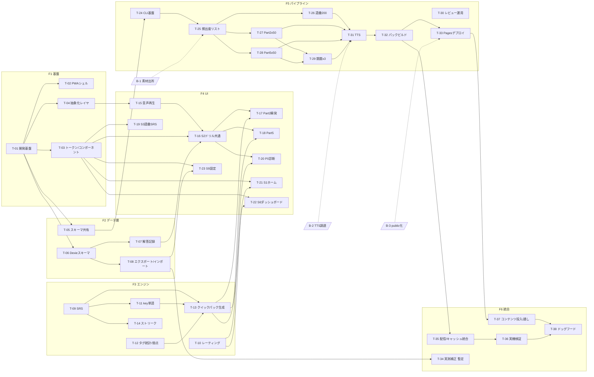

# 08. M1タスク分解

## 1. このドキュメントの位置づけ

- [06_ロードマップ](06_ロードマップ.md) の **M1: 電車ソロコア（MVP・GitHub Pagesのみで完結）** を、実装着手可能なタスク粒度（1タスク=0.5〜2人日目安）に分解したもの。
- **設計の正本は 01〜07。** 本書と 01〜07 が矛盾した場合は 01〜07 が優先し、本書を修正する。
- M1スコープ厳守。M2以降の項目（レビューUI・ディクテーション・シャドーイング・シーズン制カリキュラム・予測スコア帯/到達予測・BYOK AI質問・レイド・共有API）および 06の「意図的に見送るもの」はタスクに含めない。
- CLAUDE.md の不変条件（オフラインが正常系 / attempts は消さない / ネイティブ化を見据えた抽象化レイヤ / コンテンツの license・origin 必須 / プライバシー境界）を全タスクの前提とする。M1 は共有APIを持たないため、個人データが端末外に出る経路はエクスポートファイル（ユーザー自身の操作）のみ。

### 1.1 本書で確定した M1 スコープ解釈（正本との差分・判断）

以下は 06 と 02/03 の間で読みが分かれた点の本書としての判断。異論があれば 06 側を修正して整合させること。

| # | 論点 | 判断 | 根拠 |
|---|------|------|------|
| J-1 | 予測スコア帯の表示 | **M1はレート推移グラフのみ。予測スコア帯・到達予測の表示はM2。** レートの日次スナップショット保存はM1で行う（後から遡って描くため） | 06のM2に「予測スコア帯・到達予測」が明記。03の5.5（伸びグラフ＝レート推移＋予測帯）とは表示範囲がずれるが、ロードマップを優先 |
| J-2 | クイックパックの「現フェーズの学習配分」 | シーズン制カリキュラムはM2のため、**M1はP1相当の固定配分（語彙50% / Part2 25% / Part5 25%）を設定値としてハードコード**（外出しJSONにして変更可能にする） | 03の1.2のP1配分を暫定流用。フェーズ移行判定は実装しない |
| J-3 | 「問題おかしい」報告ボタン | **M1では実装しない。** 報告集約→出題停止フローはM3であり、M1利用者は発起人のみ。悪問はリポジトリのIssue等で直接管理する | 06のM3項目。R-6の対策の主体はパイプラインの人手レビュー（M1で実施） |
| J-4 | ダメージトースト（07の6節） | レイド前提の演出のため、M1では**獲得ポイント（基礎点）表示**として読み替えて実装するか、リザルト画面の一括表示のみとする。実装コストが小さい方を採る | 07の原則3「演出は区切りに集約」。レイドはM3 |
| J-5 | Part2「冒頭だけ再生」特訓（02の3.1） | Part2瞬発モードの出題バリエーションとして**M1に含める**。ただしスケジュール逼迫時はM1内で最後に回してよい（通常再生のPart2だけでもドッグフードは成立するため） | 02の3.1はPart2瞬発モードの一部として記載 |
| J-6 | 再生速度変更（0.7–1.3x） | **M1では実装しない**（Part2は等倍が正、03の8節。速度変更の主用途ディクテーション/シャドーイングはM2）。音声再生抽象レイヤのインターフェースには速度指定を予約しておく | 03の8節L2「Part2瞬発（等倍）」 |
| J-7 | badges / phase / pendingSync ストア | 機能はM1対象外だが、**IndexedDBストア定義（スキーマ）は04の表どおり全ストア分を最初に作る**（後からのマイグレーションを減らすため。書き込みはM1範囲のストアのみ） | 04の3節 |
| J-8 | ライトテーマ | トークン設計はダーク/ライト両対応で行うが、**M1の動作検証はダーク既定のみ必須**。ライトの実地検証は07の未決事項4のとおり後続 | 07の2節原則5・11節 |

## 2. 着手前ブロッカー

06の3節「着手前の確認事項」のうちM1に直結する3点。**いずれも未解決のまま該当タスクに着手しない。** 逆に、これら以外のタスク（基盤・データ層・エンジン）はブロッカー未解決でも着手できる。

| ID | 確認事項 | 決まらないと止まるタスク | 内容・判断基準 |
|----|---------|------------------------|---------------|
| B-1 | **手持ちJSON/PDF素材の出所確認**（01のR-1） | T-25〜T-29（コンテンツ生成一式）の**生成計画**。※出所不明の場合のデフォルトは「LLM生成に全振り」なので生成作業自体は開始できるが、手持ち素材の流用可否で生成量・工数見積が変わる | 市販教材由来なら取込まない（license/origin 必須の取込拒否ルールで機械的に弾く）。出所クリーンと確認できたもののみ 04の5節の EXTRACT 経路（LLM半自動変換→目視レビュー）に載せてよい |
| B-2 | **TTSの調達** | ✅ 解消（2026-07-13）。T-31（TTS生成）に着手可 | **Piper（ローカルTTS、MITライセンス）を採用**。無料の徹底（アカウント・カード登録不要）を最優先し、Azure Speech/Google Cloud TTS等のクラウド案（無料枠はあるがアカウント・カード登録が必要）は見送った。ローカルビルド時生成のため timing メタデータ等の外部API依存もない（M1では timing 自体不要=shadowingはM2） |
| B-3 | **リポジトリを public にできるかの最終確認** | T-33（GitHub Pages デプロイ）、T-35（配信・キャッシュ統合の実URL検証）、T-36（実機検証）。ローカル配信でT-35の大半は先行できるが、**実機ドッグフード（最終ゲート）はホスティング確定なしに開始できない** | public 不可の場合、GitHub Pages 無料運用の前提が崩れる（private は Pages 有料＋アクセス制御なし）。代替（Cloudflare Pages 等の静的ホスティング）を検討することになるが、その場合も「全世界公開に耐えるコンテンツのみ置く」原則（04の1節）は変わらない |

## 3. タスク分解

フェーズ構成: **F1 プロジェクト基盤 → F2 データ層 → F3 学習エンジン → F4 学習モードUI → F5 コンテンツパイプライン → F6 統合・ドッグフード準備**。F5 は F1/F2 のスキーマ確定後に F3/F4 と並行で進められる（クリティカルパスは F5 のコンテンツ在庫作り。人手レビューとTTSが律速）。

### F1: プロジェクト基盤

| ID | タスク | 目的 | 主な成果物 | 依存 | 完了条件 | 参照 |
|----|--------|------|-----------|------|----------|------|
| T-01 | リポジトリ構成・開発基盤 | アプリとCLIが型を共有できる開発環境を作る | monorepo構成（app / cli / shared-schema の3パッケージ想定）、Vite+React+TS雛形、ESLint/Prettier、Vitest、CIワークフロー（build+test） | なし | `npm run build` / `npm test` / lint がローカルとCIの両方で成功する。shared パッケージの型を app・cli 双方から import できる | 05の2節 |
| T-02 | PWAシェル | 機内モードでも起動する殻を作る | vite-plugin-pwa 設定（アプリシェル precache）、Web App Manifest（アイコン・theme-color ダーク`#0E1220`/ライト`#F6F5F1`・standalone）、初回起動時のホーム画面追加推奨導線 | T-01 | 一度読み込んだ後、機内モードでリロードしてもアプリシェルが起動する。iOS/Androidでホーム画面追加でき、standalone表示になる | 05の3節、07の5.2、01のR-5 |
| T-03 | デザイントークン・基本コンポーネント | 全画面が参照する見た目の土台を先に固める | CSS custom properties（07の3節トークン一式、`data-theme`切替）、数字フォント（Chakra Petch Bold サブセットWOFF2）、基本コンポーネント: 主ボタン（金56px）・選択肢ボタン（正誤時レイアウト不動）・セッション進捗バー・縦3分割レイアウトシェル | T-01 | ダーク/ライト切替が `data-theme` で動く。選択肢ボタンが押下/正解/誤答/減光の4状態を色＋アイコンの二重符号化で表示し、状態変化でレイアウトが動かない | 07の3〜6節 |
| T-04 | ネイティブ化前提の抽象化レイヤ骨格 | 将来のCapacitor移行で差し替える箇所をインターフェースとして固定する | `AudioPlayer` インターフェース（再生/停止/連結再生。速度指定は予約のみ=J-6）、`PackCache` インターフェース（Service Worker から分離したパックキャッシュ層）。通知はM1で機能を持たないためインターフェース定義のみ任意 | T-01 | app のUI・エンジンコードが音声再生とパックキャッシュを直接 Web API でなくインターフェース経由で呼ぶ構造になっている（実装はWeb版のみでよい） | 05の7節、CLAUDE.md不変条件 |

### F2: データ層

| ID | タスク | 目的 | 主な成果物 | 依存 | 完了条件 | 参照 |
|----|--------|------|-----------|------|----------|------|
| T-05 | 問題パックスキーマ共有パッケージ | app と CLI で単一のスキーマ定義を使う | shared-schema: 問題パックJSON型（schemaVersion 2: pack / questions / keyVocab / audioMeta / vocab_card フィールド）、manifest.json 型、バリデータ（license・origin 必須、answer整合、keyVocab存在、format毎の検査対象フィールド定義、音声存在チェック。エラーはパック単位で全件レポート・部分取込なし） | T-01 | 04の2節のサンプルJSONがバリデーションを通り、license欠落・answer不整合・keyVocab欠落の各異常データが**全件列挙付きで**拒否されるテストが緑 | 04の2節・2.1 |
| T-06 | IndexedDB（Dexie）スキーマ定義 | 個人データの置き場を確定する | Dexie スキーマ: 04の3節の全ストア（profile / attempts / srsCards / ratings / ratingHistory / tagStats / phase / streak / badges / pendingSync / settings）。M1で書き込むのは phase・badges・pendingSync 以外（J-7） | T-01 | 全ストアのCRUDがユニットテストで通る。attempts に削除APIを**作らない**（追記のみ）ことがコードレビューで確認できる | 04の3節 |
| T-07 | 解答記録サービス・中断復帰 | 全解答ログを落とさず、電車の離脱に耐える | attempts 書き込みサービス（mode / isCorrect / responseMs / isTimeout / answeredAt）、当て勘フラグ（応答<2秒の誤答）、時間切れの別カウント、セッション状態の1問単位自動保存と再開 | T-06 | 解答のたびにIndexedDBへ即時保存される（オフラインで一連の解答→リロード→ログ残存を確認）。セッション途中でアプリを閉じて再起動すると同じ問題から再開する | 04の3節、03の7.2、02の2.1 |
| T-08 | エクスポート/インポート | iOSストレージ退避への保険＋実測補正（T-34）の入力経路 | 全ストアをJSON1ファイルに書き出し/読み込みする機能（設定画面から呼ぶ。UIはT-23） | T-06 | エクスポート→DB全消去→インポートで attempts・srsCards・ratings ほか全ストアが復元される往復テストが通る | 04の3節、01のR-5 |

### F3: 学習エンジン（全て端末内で完結）

| ID | タスク | 目的 | 主な成果物 | 依存 | 完了条件 | 参照 |
|----|--------|------|-----------|------|----------|------|
| T-09 | SRSエンジン | 復習ループ（全設計の背骨）を作る | SM-2簡略版: 間隔テーブル `1→3→7→14→30→60日`（卒業）、自己評価3段階（もう一回=リセット / OK=次段階 / 余裕=1段階スキップ）、refType vocab/question の2種、新規上限20枚/日（変更可）、復習滞留時の新規自動停止 | T-06 | 各評価遷移・卒業・新規停止条件のユニットテストが緑。dueAt 計算が日付境界（深夜跨ぎ）で破綻しない | 03の2節 |
| T-10 | レーティングエンジン | ハンディキャップ換算と成長可視化の数値基盤 | Elo式期待正答率 `p`、基礎点（クランプ[40,130]）、レート更新 `R'=R+K(result−p)`（K=16、最初の50問はK=32）、L/R別レート＋総合平均、SRS復習をレート更新から除外、難易度写像 `d=150+170×D`、ratingHistory 日次スナップショット | T-06 | 03の5.3の計算例（レート400がd=650正解→127点等）が単体テストで一致する。SRS復習の解答でレートが動かないことをテストで確認 | 03の5節 |
| T-11 | key単語システム | 「誤答→key語彙SRS→類題」の自動循環を作る | 誤答時に keyVocab を語彙SRSへ追加、同一key単語を持つ類題の出題重みUP、類題在庫なしの場合のみ同一問題を再出題、出題理由ラベル（「復習: *submit* を使う問題」）、key単語定着後の元問題タイプ再出題 | T-06, T-09 | 誤答→srsCards にkey語彙が入る→次回パックで同key単語の類題が優先出題される、の一連がテストで再現できる。類題在庫ゼロのフォールバック（同一問題）も確認 | 03の3節、01のFR-4 |
| T-12 | タグ統計・弱点判定 | 弱点駆動出題の入力を作る | tagStats（直近100問の移動窓・タグ別正答率）、60%未満を弱点と判定、当て勘フラグ誤答の重み減、弱点タグ・key単語の出題重み1.5倍 | T-06, T-07 | 解答を流し込むと移動窓が正しく更新され、正答率60%未満のタグが弱点として抽出されるテストが緑。tagStats が attempts から再構築可能（再計算関数がある） | 03の7節、03の1.3 |
| T-13 | クイックパック生成 | 「今日のクエスト」の中身を自動構成する | 3/7/15分パック生成: 優先度①SRS期限超過カード（上限15枚/パック、溢れは次パックへ）②固定配分（J-2: 語彙50/Part2 25/Part5 25、外出しJSON）の弱点ドリル（弱点タグ・key単語1.5倍重み）。③レイド問題はM3のため実装しない | T-09, T-11, T-12 | 3分=SRSのみ / 7分=SRS+弱点ドリル / 15分=+増量、の構成がテストで確認できる。SRS期限16枚以上あるとき15枚で打ち切られ残りが次パックに回る | 03の1.3、02の2.1・2.3 |
| T-14 | ストリーク | 継続の主動線 | SRS 5問で成立する連続学習日数、ストリーク保護（週1回まで欠席免除）、lastActiveDate 管理。脅し演出はしない | T-06, T-09 | 日付跨ぎ・保護使用・保護使い切り後の途切れ、の各ケースがテストで通る | 02の7節 |

### F4: 学習モードUI（M1対象画面: S1 / S2 / S3 / S6 / S9 ＋ P0診断）

| ID | タスク | 目的 | 主な成果物 | 依存 | 完了条件 | 参照 |
|----|--------|------|-----------|------|----------|------|
| T-15 | 音声再生基盤 | モバイルの自動再生制限下で連続出題を成立させる | `AudioPlayer` のWeb実装: セッション開始タップでAudioContext解放＋Web Audioで連結再生、リプレイ、部分再生（J-5の冒頭再生用）。速度変更はM1非対象（J-6） | T-04 | iOS Safari 実機で、セッション開始後の連続出題中に再生タップを毎問要求されない。機内モードでキャッシュ済みmp3が再生できる | 05の8節、02の3.4（M1範囲のみ） |
| T-16 | S2 ドリル実行画面（共通） | 全ドリルの共通の解答体験を作る | 縦3分割レイアウト、選択肢ボタン（T-03）、正誤確定→解説カードが操作ゾーンからせり上がる（事前生成解説＋和訳表示）、セッション進捗バー＋残数、リザルト画面（正誤一覧・獲得ポイント一括表示=J-4・レート変動）。「AIに聞く」はM2のため置かない | T-03, T-07, T-15 | 出題→解答→正誤表示→解説→次問→リザルト、が片手（画面下半分の操作のみ）で完結する。誤答が復習デッキ（SRS）とkey語彙SRSに落ちたことをリザルトで確認できる | 07の7節S2、02の2.2、03の3.2 |
| T-17 | Part2瞬発モード | 看板モード（音声のみ→3択、15秒完結） | Part2出題フロー（audio_qa）、15秒タイマー＋タイムアウト記録、連続正解ストリーク表示、冒頭だけ再生の疑問詞特訓バリエーション（J-5） | T-13, T-16 | 音声再生→3択→15秒で自動タイムアウト（isTimeout記録）が動く。連続正解数が表示される。冒頭再生モードで音声先頭部分のみが再生される | 02の3.1、03の8節L2 |
| T-18 | Part5ドリル | リーディング側のコアドリル | Part5出題フロー（text_blank）、品詞・動詞の形などの文法タグの解答記録 | T-13, T-16 | Part5問題が出題→解答→解説表示でき、タグ別統計（T-12）に反映される | 02の1節、03の7.1 |
| T-19 | S3 語彙SRS画面 | 金フレ型体験の実装 | スワイプ仕分け（右=知ってる/左=知らない→SRSへ。✓✕表示、下部に同機能ボタン併設）、フレーズ音声自動再生トグル、頻出度ランクチップ（S/A/B/C）、1語1フレーズカード（vocab_card スキーマ） | T-09, T-15, T-03 | スワイプとボタンの両方で仕分けでき、「知らない」がsrsCardsに入る。フレーズ音声が自動再生トグルに従って鳴る。SRS評価3段階で復習が回る | 02の4節、07の6・7節S3、04の2節 |
| T-20 | P0診断（初回チュートリアル） | 初期レートを決める | アダプティブ30問（L15/R15）、自己申告TOEICスコアの事前値ミックス（`R=TOEIC×1000/990`）、**自己申告スコアがあれば30問をスキップしてその換算値をそのままL/R初期レートに確定できる導線**（2026-07-13追加）、診断結果→ratings 初期化、初回導線（ホーム画面追加推奨=T-02と接続） | T-10, T-16, T-32のパック* | 初回起動→診断30問→L/R初期レート決定→ホームに遷移する。自己申告あり/なしの両方で初期値が設定される。自己申告ありの場合は30問をスキップしても同様にL/R初期レート決定→ホームに遷移できる。*開発中はダミーパックで先行可、最終確認は実パックで行う | 03の1.2 P0・5.1 |
| T-21 | S1 ホーム画面 | 起動即開始（3秒以内・迷わせない） | 「今日のクエスト」主ボタン＋3/7/15分切替チップ、SRS期限数、ストリーク表示、下方グリッドに各モード（Part2瞬発・Part5・語彙SRS・ダッシュボード・設定）。レイドHPバーはM3のため置かない | T-13, T-14, T-03 | ホーム画面アイコン起動→クエスト開始まで2タップ以内。SRS期限数とストリークが実データで表示される | 07の7節S1、02の2.1、01の非機能要件（起動3秒） |
| T-22 | S6 ダッシュボード | 成長の可視化（M1範囲） | レート伸びグラフ（折れ線1系列・金・終端値直付け。**予測スコア帯はM2=J-1**）、弱点マップ（レーダー不使用・弱い順ソート横棒）、学習ヒートマップ（金5段・GitHub草式） | T-10, T-12, T-03 | ratingHistory から伸びグラフが描画される。tagStats から弱点横棒が弱い順に並ぶ。チャート系列色が07の3.4の検証済みパレットのみを使っている | 07の7節S6・8節、03の5.5（表示はJ-1の範囲） |
| T-23 | S9 設定画面 | 運用に必要な設定とデータ保全の入口 | 表示名、イヤホンなしモード（リスニング→リーディング差替）、テーマ切替（OS追従＋手動）、文字サイズ3段階、キャッシュ使用量表示＋手動削除、エクスポート/インポートUI（T-08）。BYOK APIキー欄はM2のため置かない | T-08, T-35 | イヤホンなしモードONでクイックパックからリスニング問題が除外される。キャッシュ使用量が表示され手動削除できる。エクスポートファイルがダウンロードでき、インポートで復元される | 02の2.2、04の6節、07の7節S9 |

### F5: コンテンツパイプライン（CLI・ビルド時のみ。ランタイム課金ゼロ）

人手レビューは **スプレッドシート/JSONL＋目視** で行う（06の記載どおり）。専用レビューUIはM2であり、本フェーズに含めない。

| ID | タスク | 目的 | 主な成果物 | 依存 | 完了条件 | 参照 |
|----|--------|------|-----------|------|----------|------|
| T-24 | CLI基盤 | パイプラインの骨格 | cli パッケージ（TS/Node）: コマンド体系（generate / review-export / review-import / tts / build）、LLM・TTS APIキーは環境変数のみ（リポジトリに含めない） | T-01, T-05 | 各コマンドの雛形が動き、APIキーが環境変数から読まれる（コード・設定ファイルにキーが存在しないことを確認） | 05の2節、04の5節 |
| T-25 | 自前頻出度リスト構築 | 金フレ型体験の土台（著作権クリーンな頻出度データ） | 公開コーパス＋LLM推定による S/A/B/C ランク付き頻出度リスト、Sランク200語の選定。**精度は未検証**であり実測補正（T-34）で継続修正する前提を成果物に明記 | T-24, B-1 | Sランク200語がランク根拠（コーパス由来/LLM推定の別）付きでリスト化されている。市販リスト・金のフレーズを参照していないことがレビューで確認できる | 03の4節、01のR-1 |
| T-26 | 語彙カード生成（Sランク200語） | 初期語彙コンテンツの在庫 | LLM生成: 1語1フレーズ＋和訳＋levelBand（vocab_card スキーマ準拠）。レビュー用JSONL出力→目視レビュー→取込 | T-25, T-30 | レビュー済み200語がスキーマバリデーション（T-05）を通る。フレーズが既存教材の流用でないことをレビュー観点に含めて確認済み | 04の2節、02の4節 |
| T-27 | Part2問題生成（50問） | リスニング側の初期在庫 | LLM生成: 問題＋解説（正解根拠＋各誤答がダメな理由）＋和訳＋keyVocab抽出＋タグ（疑問詞聞き取り・弱形等）。JSONL往復レビュー | T-25, T-30 | レビュー済み50問がバリデーションを通り、全問に keyVocab・タグ・解説が付いている | 04の2節・5節、03の7.1 |
| T-28 | Part5問題生成（50問） | リーディング側の初期在庫 | LLM生成: 品詞・動詞の形中心のtext_blank 50問＋解説＋keyVocab＋文法タグ。JSONL往復レビュー | T-25, T-30 | 同上（50問） | 04の2節・5節、03の1.1 |
| T-29 | key単語類題生成 | 「誤答→類題」の在庫 | 頻出度上位のkey単語 1語につき類題3問を事前生成（ランタイムLLM生成はしない）。対象key単語はT-27/T-28の keyVocab 上位から選定 | T-27, T-28, T-30 | 対象key単語全てに類題3問が存在し、各類題の keyVocab に当該単語が含まれることをバリデーションで確認できる | 03の3.2、04の5節 |
| T-30 | レビュー運用フロー整備 | レビューUIなしで量産レビューを回す最小の型 | JSONL⇔スプレッドシート往復フォーマット（採用/修正/破棄ステータス列、破棄理由列）、破棄理由→生成プロンプト改善のフィードバック手順（手順書レベルでよい） | T-24 | 生成→JSONL出力→スプレッドシートで目視判定→取込、の1サイクルがダミーデータで通る。破棄理由が記録として残る | 06のM1（レビューUIはM2）、04の5節 |
| T-31 | TTS生成 | 音声付きコンテンツの完成 | TTS生成コマンド: 話者ローテーション（米/英/豪の3アクセントを `audioMeta.accent` に記録。加はM1で使わない=04の5節）、Part2は設問と応答で別話者、語彙フレーズ音声（phraseAudio）、mp3モノラル64–96kbps、聴感確認で不自然なものは破棄（→再生成 or 問題破棄） | T-24, T-26〜T-29, **B-2** | 全問・全語彙カードに音声ファイルが生成され、audioMeta（accent/voice/durationMs）が記録される。聴感確認の破棄基準がレビュー手順（T-30）に追記されている | 04の5節・6節、05の8節（TTS品質リスク） |
| T-32 | パックビルド・manifest生成 | 配信可能な成果物にまとめる | build コマンド: スキーマ検証一括実行（T-05のバリデータ。エラーはパック単位で全件レポート・部分取込なし）、manifest.json 生成（id・タイトル・対象レート帯・sizeBytes・バージョンハッシュ）、license/origin 欠落パックの取込拒否 | T-05, T-31 | 初期4種のパック（語彙/Part2/Part5/類題）がビルドされ manifest に載る。license 欠落パックを混ぜるとビルドが失敗する | 04の2節・2.1 |
| T-33 | GitHub Actions デプロイ | 静的配信ラインの完成 | Pages デプロイワークフロー（アプリ＋パック＋音声＋manifest）、Secrets 管理（LLM/TTSキーはActions Secretsのみ） | T-32, **B-3** | main への push で Pages に配信され、実URLから manifest とパックが取得できる。リポジトリ履歴にAPIキー・個人名・成績が含まれない | 05の1節・6節、04の5節 |
| T-34 | 実測補正の暫定運用ライン | 難易度・頻出度の実測補正入力（M1は手動） | 発起人端末のエクスポートJSON（T-08）→ 問題別正答率・key単語誤答関与回数の手動集計スクリプト → 難易度D・頻出度ランク補正値のビルド入力フォーマット。**匿名問題統計（questionStats）への自動化はM3であり、ここでは作らない** | T-08, T-32 | エクスポートファイルを入力に補正値ファイルが生成され、次回ビルドで difficulty に反映される（ドッグフード2週目以降に1回実施できれば足りる） | 06のM1、04の5節、03の4節・5.2 |

### F6: 統合・ドッグフード準備

| ID | タスク | 目的 | 主な成果物 | 依存 | 完了条件 | 参照 |
|----|--------|------|-----------|------|----------|------|
| T-35 | コンテンツ配信・キャッシュ統合 | オフライン正常系の完成 | manifest 参照の更新検知、パック自動ピン留めダウンロード（M1は全パックで容量的に足りる想定。manifest の sizeBytes 合計で確認）、`PackCache` 経由のキャッシュ管理（T-04）、オンデマンド＋LRUはコンテンツ量が閾値を超えた場合のみ（M1では未使用の可能性が高い） | T-04, T-32（実URL検証はT-33/B-3） | 初回オンラインでパック＋音声が自動キャッシュされ、以後**機内モードで診断→クエスト→語彙SRSの全機能が動く**。パック更新（ハッシュ変化）が検知され再取得される | 05の3節、04の2.1・6節 |
| T-36 | 実機検証（iOS / Android） | ドッグフード環境（発起人の実端末）での動作保証 | iOS Safari: ホーム画面追加→standalone起動、音声自動再生制限下の連続出題（T-15）、機内モード動作、ストレージ挙動の記録。Android Chrome: 同等確認 | T-35, T-21, T-17, T-19 | 発起人の実端末で「ホーム画面起動→3秒以内に学習開始可能」「トンネル相当（機内モード）で1セッション完走」「中断→再開」が確認できる | 01の非機能要件、05の8節、01のR-5 |
| T-37 | 初期コンテンツ投入・通し確認 | コンテンツ実量での学習ループ検証 | Sランク語彙200語＋Part2×50＋Part5×50＋key単語類題×3問 の全量を実配信し、P0診断→クイックパック→誤答→key語彙SRS→類題出題→SRS復習の一連を実データで通す | T-33, T-20, T-35, T-26〜T-29 | 初期コンテンツ全量が manifest 経由で配信・キャッシュされる。誤答したkey単語の類題が翌セッションで実際に出題されることを実機で確認 | 06のM1（初期コンテンツ量）、03の3節 |
| T-38 | ドッグフード開始・計測準備 | 最終ゲート（2週間毎日）の実施体制 | KPI確認手順（週あたり学習日数・電車セッション数/週・SRS消化率を端末内データ＋エクスポートで週次確認）、悪問メモの運用（J-3: アプリ内報告なし、Issue等で記録）、2週間ドッグフードの開始判定チェック（5節） | T-36, T-37 | 5節の統合チェックが全て通り、ドッグフードを開始した状態。週次でKPIを取り出す手順が文書化されている | 06の4節 |

## 4. 依存関係の全体図

**クリティカルパス（見込み）**: T-01 → T-05 → T-24 → T-25 → T-26/27/28（生成＋**人手レビュー**）→ T-31（**TTS=B-2**）→ T-32 → T-33（**B-3**）→ T-37 → T-38。06の指摘どおりレビュー工数が最大のボトルネックであり、F5の生成・レビューはF3/F4の実装と並行で最優先に走らせる。B-2/B-3 はクリティカルパス上にあるため、着手初週に解消すること。

## 5. M1完了条件（ゲート）

**最終ゲート（06のM1完了条件そのまま）: 発起人が電車往復で2週間毎日使い続けられ、SRSと弱点出題が体感として機能していること。**

最終ゲートの判定は主観を含むため、ドッグフード開始前に以下の統合チェック（客観判定可能）を全て通すこと。1つでも落ちる場合はドッグフードを開始しない。

### 5.1 ドッグフード開始前チェック

- [ ] **オフライン正常系**: 機内モードで、ホーム起動→クイックパック（3/7/15分）→語彙SRS→リザルトまで全て完走できる（ネットワークエラーが一切表面化しない）
- [ ] **起動速度**: ホーム画面アイコンから3秒以内に「今日のクエスト」を開始できる状態になる（実機・キャッシュ済み状態で計測）
- [ ] **中断耐性**: セッション途中でアプリを閉じて再起動すると同じ問題から再開し、解答済みログが失われていない
- [ ] **復習ループ実動**: ドリル誤答→key単語が語彙SRSに入る→同key単語の類題が後続セッションで出題される→出題理由ラベルが表示される、の一連が実コンテンツで確認できる
- [ ] **SRS実動**: 期限到来カードがクイックパック先頭に来る（上限15枚、溢れは次パック）。新規上限20枚と復習滞留時の新規停止が効いている
- [ ] **レーティング実動**: 全解答（SRS復習除く）でL/R別レートが更新され、日次スナップショットが溜まり、ダッシュボードの伸びグラフに反映される
- [ ] **P0診断**: 新規プロファイルで診断30問（L15/R15）が動き、初期レートが決まる
- [ ] **ストリーク**: SRS 5問で当日分が成立し、保護（週1）が機能する
- [ ] **初期コンテンツ全量**: Sランク語彙200語（フレーズ音声付き）／Part2×50問／Part5×50問／key単語類題×3問が Pages から配信され、全て license/origin 付きでバリデーションを通過している
- [ ] **音声**: iOS実機で連続出題中に毎問の再生タップを要求されない。全音声がオフラインキャッシュから再生できる
- [ ] **データ保全**: エクスポート→インポートの往復で全ストアが復元される。attempts に削除経路がない
- [ ] **プライバシー境界**: リポジトリ・配信物に個人名・社名・成績・APIキーが含まれない（公開前の最終grep確認）
- [ ] **設定**: イヤホンなしモードでリスニング問題がリーディング系に差し替わる

### 5.2 ドッグフード期間中（2週間）の確認事項

- [ ] 週あたり学習日数・電車セッション数・SRS消化率を週次で記録する（エクスポート＋T-34の集計スクリプト）
- [ ] 「SRSと弱点出題が体感として機能しているか」の主観メモを週次で残す（機能していない場合、何が邪魔かを具体化してM2計画に入力する）
- [ ] 悪問・音声の不自然さはIssue等に記録し、T-34の補正またはコンテンツ修正の入力にする
- [ ] iOSストレージ退避・データ消失の兆候が出た場合は即記録する（05の7節のネイティブ化前倒し判断の入力）

最終ゲート通過後、実測データ（T-34）と体感メモをもってM2（リスニング深化＋カリキュラム）の計画に入る。
