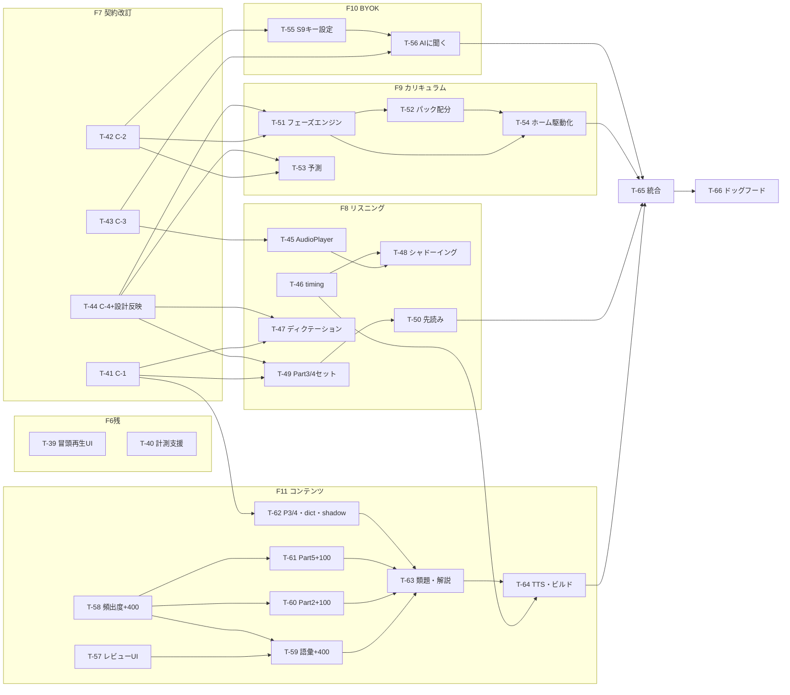

# 12. M2タスク分解（M1クローズアウト含む）

## 0. 位置づけ

- [06_ロードマップ](06_ロードマップ.md) の **M2（リスニング深化＋カリキュラム）** と、M1の残作業（クローズアウト）を実装タスクに分解する。設計の正本は 01〜07 であり、本書は従属する（矛盾したら 01〜07 が優先し本書を直す）。[08_M1タスク分解](08_M1タスク分解.md) のM2版にあたる。
- タスクIDは 08 の続番（**T-39〜T-66**）。判断事項も 08 の J-1〜J-8 の続番（**J-9〜J-29**）。
- 実装着手時は [13_M2実装計画](13_M2実装計画.md) のタスクシート（1タスク=1セッションの自走用作業指示）に従う。13 は本書に従属する。
- 進捗の正本は [STATUS.md](STATUS.md)。並行開発・契約の運用は [09_開発体制](09_開発体制.md) に従う。

## 1. スコープと判断事項

### 1.1 M2で作るもの（06のM2定義の具体化）

1. **カリキュラム駆動の「今日のクエスト」**（M2完了条件の核）: シーズン制フェーズ P1–P3・リスニング段階 L1–L4 の達成条件判定と、フェーズ配分に基づくクイックパック生成。
2. **リスニング深化**: ディクテーション（弱形・連結）・シャドーイング支援（カラオケ式）・Part3/4先読みトレーナー・再生速度/位置制御。
3. **予測スコア帯・到達予測**: S6ダッシュボードのヒーロー数値＋到達予測、実試験スコアの任意登録。
4. **AI解説**: 事前生成解説の全問整備＋BYOKオンデマンドAI質問（S9キー設定含む）。
5. **量産体制**: レビューUI（S10）＋コンテンツ増強（語彙600語 / Part2・Part5各150問 / Part3・4各10セット / ディクテーション短文40本 / シャドーイング素材30本 = J-9）。
6. **M1クローズアウト**: 冒頭再生モードのUI導線、ドッグフード計測支援（T-36〜T-38の人間作業を最小化する手順書・コマンド）。

### 1.2 判断事項（設計正本に無い点の事前確定。詳細仕様は13の3節）

02/03/04/05/07 に設計記述が無い・薄い点を、着手前にここで確定する（Sonnetクラスの自走で設計判断による停止・暴走を防ぐため）。**具体的な数値・スキーマ・アルゴリズムの正文は [13の3節](13_M2実装計画.md) に置き、契約改訂タスク（T-41〜T-44）で 02/03/04/05 の該当節へ反映する**。根拠は [ADR 0004](adr/0004-M2の設計確定と実装方式.md)。

| ID | 判断 | 内容（要約） |
|----|------|-------------|
| J-9 | Part3/4等のコンテンツをM2スコープに明記 | 06のM2定義（語彙600/Part2・Part5各150）に加え、先読みトレーナー・L3・P2配分が要求する Part3×10セット＋Part4×10セット（各3問）、ディクテーション短文40本、シャドーイング素材30本（Part3/4スクリプト流用20＋Part2応答文10）を M2 コンテンツに含める。**Part6/7・Part1（audio_photo）の量産はM3以降**（P2/P3配分のPart7枠は暫定テンプレで語彙・Part5に振替） |
| J-10 | 先読みトレーナーは専用画面を作らない | S2ドリルの「セットモード」拡張（audio_set用フロー: 先読み→再生→設問ごと解答）として実装 |
| J-11 | ルーターレス継続 | M2でも react-router は導入しない（ADR 0003 の再検討条件「共有URL・画面復元の要件」が発生していない） |
| J-12 | ディクテーションはワードバンク方式のみ | 02の3.2の「タイピングは設定で選択可」はM2では実装しない（見送り。02を更新） |
| J-13 | シャドーイングの記録規約 | 正誤なし。attempts に `questionId: 'shadow:<id>'`・isCorrect=true 固定で実施ログとして追記。レート・tagStats・SRS対象外（`vocab:` と同じプレフィックス除外方式）。ストリークにはカウント |
| J-14 | BYOKはAnthropic API直fetch | SDK追加なし・CORSオプトインヘッダでブラウザ直呼び。対話履歴は永続化しない（画面離脱で破棄） |
| J-15 | 到達予測の外挿式 | ratingHistory（total）直近28日の線形回帰。データ14日未満は「計測中」、傾き≤0は「このペースでは到達しない」＋不足量表示。月粒度・断定しない表示（01のR-2） |
| J-16 | フェーズ達成条件の具体値 | P1→P2 = Sランク定着率85%＋Part2正答率70%（03既定）。**P2→P3 = Aランク定着率75%＋Part3/4セット正答率60%（直近20セット）＋Part5正答率70%**。P3卒業は自動判定せず、実試験スコア登録（total≥760）で「シーズンクリア」表示 |
| J-17 | criteriaJson スキーマ | `{ "all": [ {type, ...} ] }` 形式の条件配列（srsRetention / accuracy / setAccuracy / examScore の4種）。13の3.2が正文 |
| J-18 | 初期フェーズ割当 | P0診断（または自己申告）の総合レート R<550→P1、550≤R<650→P2、R≥650→P3。M1からの既存ユーザーは初回のM2起動時に現レートで1回だけ割当 |
| J-19 | L1–L4とP1–P3の統合 | phase レコードに `listeningStage` を追加し、P と独立に達成条件判定。P配分の「リスニング枠」の内訳を L 段階が決める（合成式は13の3.2） |
| J-20 | 実試験スコアは新ストア examScores | 03の5.5・06の4節の任意登録の格納先。C-2改訂（DB version(2)）で追加 |
| J-21 | コンテンツ増強はM1方式踏襲 | ランタイムAPI呼び出しなし・エージェント直接執筆・別モデルAIクロスレビュー＋人間レビュー（T-25〜T-29の前例）。ユーザー指示があれば `@anthropic-ai/sdk` 生成に切替可（generateコマンドはkindディスパッチ済みで対応可能） |
| J-22 | 新パック構成 | pack-vocab-a-001 / pack-vocab-b-001 / pack-p2-s-002 / pack-p5-s-002 / pack-p34-s-001 / pack-dict-s-001 / pack-shadow-s-001 を増設。levelBand は A=730・B=860（03の4節の章立て） |
| J-23 | 区間リピートは文単位 | スクリプトを文境界（. ? !）で分割し、タップで文選択→ループ。A-B自由指定は作らない |
| J-24 | 先読み秒数 | P2=15秒・P3=10秒（フェーズで決定）。満了で自動再生開始、早期開始タップ可 |
| J-25 | BYOKキーの保護 | settings `byokApiKey`（端末内平文・04既定）。**エクスポート除外リスト**（`EXPORT_EXCLUDED_KEYS`）で backup.ts から除外（レビューフォローアップの必須項目）。UI表示は常にマスク・支出上限付きキー推奨の注記 |
| J-26 | timing は推定アライメント | Piper は単語タイムスタンプを出力しない前提で設計。実測 durationMs を音節数近似＋句読点ポーズ補正で按分する推定方式。精度不足なら文単位ハイライトに縮退（強制アライメントツールの依存追加はしない） |
| J-27 | 再生速度はピッチ維持方式 | `AudioBufferSourceNode.playbackRate` はピッチが変わるため使わない。rate指定時のみ HTMLAudioElement 経路（`preservesPitch`）を WebAudioPlayer 内に併設。未対応環境はピッチ変化を許容（注記表示） |
| J-28 | レビューUIは packages/review-ui | 新ワークスペース（Vite+React、ローカル起動専用・デプロイ対象外）。FS読み書きは dev ミドルウェア方式（contentAssetsPlugin と同型）。cli の `GeneratedItemDraft` 契約を流用 |
| J-29 | ディクテーションはレート更新対象外 | 03の5.3の得点式は選択式前提のため。tagStats には記録する（弱形タグ正答率が L1 卒業判定の入力）。attempts は通常どおり記録 |

### 1.3 M2で実装しないもの（明示リスト）

- **M3以降**: 共有API・レイド全て・pendingSync の送信・questionStats 自動収集・「問題おかしい」報告のサーバ集約（M2でも悪問はIssue運用=J-3継続）・Part6/7・Part1 コンテンツ量産
- **v2/M5判断**: 録音シャドーイング・シャドーイング自動採点・AI解説のプロキシ昇格・学習ログ自動バックアップ・Capacitorネイティブ化
- **見送り継続**: タイピング式ディクテーション（J-12）・A-B自由区間リピート（J-23）・強制アライメント依存の導入（J-26）・ルーター導入（J-11）・AI対話履歴の永続化（J-14）

## 2. 着手前ブロッカー

| ID | 内容 | 状態 |
|----|------|------|
| B-4 | Piper の単語タイムスタンプ取得可否 | 🔶 **フォールバック確定済みのため進行可**（J-26: 推定アライメントで設計。T-46 で実挙動を検証し、取得可能ならそちらを使う） |
| B-5 | M2コンテンツの作成方式 | ✅ 実質解消（J-21: M1方式踏襲がデフォルト。変更はユーザー指示による） |
| B-6 | BYOK実キーでの疎通確認 | 🔴 人間（発起人のAnthropic APIキー）。T-56 の🟡チェックポイント。実装・テストはモックで自走可 |
| B-7 | コンテンツレビュー工数の確保 | 🔴 M2もコンテンツレビューが律速（M1と同じ）。レビューUI（T-57）を先行させ負荷を下げる |

## 3. フェーズとタスク一覧

完了条件の詳細・実装指示は [13](13_M2実装計画.md) の各シートが持つ。

### F6残: M1クローズアウト

| ID | タスク | 目的 | 主な成果物 | 依存 | 完了条件 | 参照 |
|----|--------|------|-----------|------|----------|------|
| T-39 | 冒頭再生モードUIトグル | 実装済み機能（J-5）への到達導線 | Part2単独モード起動時のトグルUI | T-17(済), T-21(済) | トグルで `partialAudioMode` が切り替わり、冒頭再生セッションが起動できる | STATUSのF4引き継ぎ、02の3.1 |
| T-40 | ドッグフード計測・検証支援 | T-36〜T-38（人間主体）の作業コスト最小化 | cli `kpi` コマンド（週次KPI集計）、実機検証チェックリスト、通し確認手順書、悪問Issueテンプレート | T-08(済), T-34(済) | エクスポートJSONから週あたり学習日数・セッション数/週・SRS消化率が出力される。手順書がdocsにある | 08のT-36〜T-38行、06の4節 |

### F7: M2契約改訂（各タスク=契約変更のみの単独PR。09の2節）

| ID | タスク | 目的 | 主な成果物 | 依存 | 完了条件 | 参照 |
|----|--------|------|-----------|------|----------|------|
| T-41 | C-1改訂: スキーマ検証強化 | M2フォーマットの検証穴を塞ぐ | validate.ts（audio_photo image必須・dictation blanks整合・levelBand enum・timing/script整合）、04の2節更新 | なし | STATUS既知の穴3件＋blanks/script突合の検証がテスト付きで入る | 04の2節、STATUS既知の穴 |
| T-42 | C-2改訂: DBスキーマ v2 | M2の永続データの受け皿 | Dexie version(2)（examScores 新ストア・phase.listeningStage）、BYOK settingsキー定義、`EXPORT_EXCLUDED_KEYS`（backup除外）、04の3節更新 | なし | マイグレーションテスト（v1データが壊れない）。エクスポートに byokApiKey が含まれないテスト | 04の3節・6節、J-20/J-25 |
| T-43 | C-3改訂: platform拡張 | 再生制御とAI呼び出しの抽象化 | `PlayOptions.onPosition`・rate本実装宣言（J-27）、新規 `platform/ai/AiClient` IF、05の該当節更新 | なし | IF定義＋フェイク実装＋既存実装の後方互換テスト | 05の5節・7節、J-14/J-27 |
| T-44 | C-4改訂: エンジンIF拡張＋設計反映 | カリキュラム・予測・新format対応の型確定 | engine/types.ts 拡張（curriculum/forecast/dictation/preread）、13の3節の設計を 03・02 へ反映 | なし | 型定義＋既存エンジンのビルド通過。03に P2→P3条件・到達予測式・定着定義・L×P統合・先読み秒数・J-12/J-13/J-29 が反映されている | 03の1.2・5.5・8節、02の3節 |

### F8: リスニング深化

| ID | タスク | 目的 | 主な成果物 | 依存 | 完了条件 | 参照 |
|----|--------|------|-----------|------|----------|------|
| T-45 | AudioPlayer実装拡張 | 速度・位置通知の実動化 | WebAudioPlayer の rate（preservesPitch経路）・onPosition 実装 | T-43 | rate 0.7〜1.3 で再生されるテスト（フェイク）＋PC Chrome実再生確認。🟡ピッチ維持の聴感は人間 | J-27、02の3.4 |
| T-46 | timing推定アライメント | カラオケハイライトのデータ源（B-4解消） | cli `timing` 生成（推定アライメント）、Piper実挙動の検証記録 | T-31(済) | 実mp3で単調増加・末尾≦duration の timing が生成される。B-4 の検証結果が記録される | J-26、04の2節 |
| T-47 | ディクテーション | L1訓練の実装 | engine 採点＋ワードバンク生成、DrillScreen の dictation 分岐 | T-41, T-44 | ワードバンク出題→全穴一致判定→tagStats反映（レート除外=J-29）がテストで通る | 02の3.2、03の8節、J-12/J-29 |
| T-48 | シャドーイング画面（S4） | L1訓練の実装 | 新規 ShadowingScreen（カラオケハイライト・速度・文単位リピート・3秒戻し・スクリプト3段階表示） | T-43, T-45, T-46 | ハイライト同期・速度切替・文リピート・実施ログ記録（J-13）がテストで通る | 02の3.3-3.4、07の6節・7節S4 |
| T-49 | Part3/4セット出題 | audio_set の S2 対応 | DrillScreen のセットモード（1音声→設問3問順次） | T-41, T-44 | セット再生→設問順次解答→attempts がサブ設問IDで記録される | 04の2節（audio_set）、03の8節L3 |
| T-50 | 先読みトレーナー | L3訓練の「型」強制 | セットモードの先読みフェーズ（タイマー→再生→解答） | T-49 | 先読みN秒→自動再生→設問ごと解答の状態遷移がテストで通る。セット正解判定がエンジンに入る | 02の3.5、J-10/J-24 |

### F9: カリキュラム・予測（M2完了条件の核）

| ID | タスク | 目的 | 主な成果物 | 依存 | 完了条件 | 参照 |
|----|--------|------|-----------|------|----------|------|
| T-51 | フェーズエンジン | P1–P3/L1–L4 の判定と永続化 | engine/curriculum.ts（criteriaJson評価・初期割当・phase書込）、curriculumConfig.json | T-42, T-44 | 各条件タイプの判定・移行・初期割当（J-18）がテストで通る。phase ストアに記録される | 03の1.2・8節、J-16〜J-19 |
| T-52 | クイックパックのフェーズ配分 | 配分合成の実装 | generateQuickPack のフェーズテンプレ対応（SRS優先→配分→弱点重み→L内訳） | T-51 | フェーズ・L段階ごとに配分が変わるテスト。既存M1挙動（P1相当）が回帰しない | 03の1.3、02の2.3、J-19 |
| T-53 | 予測スコア・到達予測 | S6の完成（J-1解除） | engine/forecast.ts、S6ヒーロー数値・予測帯・到達予測表示、実試験スコア登録UI（examScores） | T-42, T-44 | 予測帯±50・28日回帰・不足量表示・「計測中」がテストで通る。断定表現がない | 03の5.5、07の7節S6・8節、J-15/J-20 |
| T-54 | ホームのカリキュラム駆動化 | 「今日のクエスト」の完成 | HomeScreen のシーズン表示・クエスト構成のフェーズ駆動化 | T-51, T-52 | フェーズ・L段階に応じたクエストが1タップで始まる（M2完了条件のUI側） | 06のM2完了条件、02の2.1 |

### F10: AI解説・BYOK

| ID | タスク | 目的 | 主な成果物 | 依存 | 完了条件 | 参照 |
|----|--------|------|-----------|------|----------|------|
| T-55 | S9 BYOK設定 | キー管理UI | SettingsScreen のAPIキー欄（マスク表示・注記・削除） | T-42 | 保存・マスク・削除・エクスポート除外の結線がテストで通る | 07の7節S9、05の5節、J-25 |
| T-56 | AIに聞く | オンデマンドAI質問 | AiClient実装（Anthropic直fetch）、解説カードの「AIに聞く」UI（未レビュー注記・オフライン無効化） | T-43, T-55 | モックでの対話・キー未設定/オフライン時の無効化がテストで通る。🟡実キー疎通は人間 | 02の8節、05の5節、J-14 |

### F11: レビューUI・コンテンツ増強（Track C。レビューが律速なので最優先で並走）

| ID | タスク | 目的 | 主な成果物 | 依存 | 完了条件 | 参照 |
|----|--------|------|-----------|------|----------|------|
| T-57 | レビューUI（S10） | レビュー工数の削減（量産体制） | packages/review-ui（採用/修正/破棄GUI・フィールド別フォーム・バリデーション表示・音声プレビュー） | T-30(済) | ドラフトJSONL読込→レビュー→accepted/rejected.jsonl 書出の1サイクルがUIで完結する | 04の5節、11、07の7節S10、J-28 |
| T-58 | 頻出度リスト拡充 | A/Bランク各200語の選定 | freq-list への400語追加（計600） | T-25(済) | 重複なし・全語根拠付き・機械検証通過。🟡目視確認は人間 | 03の4節、J-21 |
| T-59 | 語彙カード生成（+400） | 語彙600語体制 | A/Bランク400語の vocab_card | T-57, T-58 | バリデーション通過＋クロスレビュー実施。🟡人間レビュー | 02の4節、J-21/J-22 |
| T-60 | Part2生成（+100） | Part2 150問体制 | 追加100問（難易度2〜4分散・間接応答2割まで） | T-57, T-58 | 同上（正答キー分散・音声知覚タグ必須も機械検証） | 03の7.1・8節、J-21 |
| T-61 | Part5生成（+100） | Part5 150問体制 | 追加100問（文法タグ5分類の網羅バランス） | T-57, T-58 | 同上 | 03の7.1、J-21 |
| T-62 | Part3/4・dict・shadow素材 | 新format用コンテンツ | Part3×10・Part4×10セット、ディクテーション短文40、シャドーイング素材30 | T-41, T-57, T-58 | blanks/subQuestions/timing予約のスキーマ検証通過。🟡人間レビュー | J-9/J-22、04の2節 |
| T-63 | 類題拡充・解説整備パス | key単語循環の維持・解説全問確認 | 新規keyVocabの類題、全問 explanation の品質パス | T-59〜T-62 | 類題の対象語包含チェック・explanation欠落ゼロの機械検証 | 03の3.2、02の8節 |
| T-64 | TTS全量・パック再編ビルド | M2コンテンツの配信 | 全量TTS（timing付与）・新パック7種ビルド・manifest・デプロイ | T-46, T-59〜T-63 | 全パックがビルド・実URL配信される。🟡聴感確認は人間 | 04の5節、J-22/J-26 |

### F12: M2統合・ドッグフード

| ID | タスク | 目的 | 主な成果物 | 依存 | 完了条件 | 参照 |
|----|--------|------|-----------|------|----------|------|
| T-65 | M2統合・通し確認 | 全機能の結合検証 | M2通し確認手順書、発見不具合の修正 | T-39〜T-64 | 5.1のAI検証可能項目が全て通る。🔴実機通しは人間 | 5節 |
| T-66 | M2ドッグフード開始判定 | 最終ゲート | 5.1チェック全通し→2週間ドッグフード | T-65 | 5.1が全て✅ | 06のM2完了条件 |

## 4. 依存関係とクリティカルパス

**クリティカルパス（見込み）**: ①コンテンツ系 T-58 → T-59/T-60/T-61/T-62（生成＋**人間レビュー**）→ T-63 → T-64 → T-65（M1同様、レビュー工数が律速。T-57 レビューUIを先行させて負荷を下げる）。②機能系は T-44 → T-51 → T-52 → T-54（M2完了条件の核）。F7の4タスクが全M2タスクの前提なので最初に片付ける。

## 5. M2完了ゲート

### 5.1 開始前チェックリスト（T-66で全通し）

- [ ] ホームの「今日のクエスト」がフェーズ（P1–P3）・L段階・SRS期限から自動構成され、ユーザー操作は1タップ（06のM2完了条件）
- [ ] フェーズ移行が達成条件で発火し、移行時にユーザーへ通知表示される（時間経過で進級しない）
- [ ] ディクテーション・シャドーイング・先読みトレーナーが L 段階に応じて出題・解禁される
- [ ] 予測スコア帯・到達予測が S6 に表示される（断定表現なし・「参考値」明記・計測中/不足時の表示が正しい）
- [ ] 実試験スコアを登録でき、予測との乖離が確認できる
- [ ] 全問題に事前生成解説があり（機械検証）、BYOKキー設定時のみ「AIに聞く」が活性化する
- [ ] BYOKキーがエクスポートJSONに含まれない（機械検証）
- [ ] コンテンツ体制: 語彙600 / Part2 150 / Part5 150 / Part3・4各10セット / dict 40 / shadow 30 がレビュー済みで実URL配信されている
- [ ] レビューUIで生成→レビュー→取込の1サイクルが回る（発起人が実際に操作）
- [ ] 機内モードで新機能（ディクテーション・シャドーイング・セット出題）を含む1セッションが完走する
- [ ] 🔴 発起人の実機で M2 機能の通し確認（T-65）→ 2週間ドッグフード開始

## 6. 契約の改訂（09の2節への追記）

M2で C-1〜C-4 の全てに改訂が入る。**改訂は F7 の4タスク（T-41〜T-44）でのみ行い、各タスク=契約変更のみの単独PR**とする（09の変更ルールどおり）。F7完了後は M1 と同様に「契約は確定済み・変更は停止条件」に戻る。F8以降のタスクで追加の契約変更が必要になったら、そのタスクを止めて人間に確認する。
